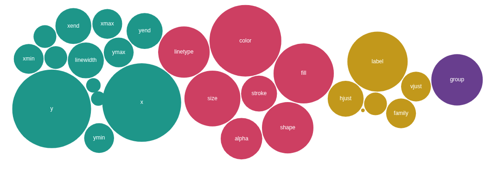

Every plot in `ggplot2` begins with aesthetic mappings: **which variables you want to show**, and **how you want to represent them visually**.

# What Exactly Are Aesthetics?

An aesthetic is a link between a variable in your data and a visual feature of the plot. For example:

-   the position of points along the axes,
-   the fill color of bars, or
-   the type of width of a line.

You’re not setting these properties manually — you define them by linking it to your data using the `aes()` function. Once the mapping is in place, `ggplot2` takes care of translating your data into the aesthetics of your choice.

The magic of aesthetic mapping: It's always driven by data!

# Adding More Aesthetics

You can map additional aesthetics to make your plots more informative — for example, by linking the color, shape, or size of your points to variables in your dataset.

Depending on the type of variable you map to the `color` aesthetic, `ggplot2` will either use a categorical palette (for character and factor variables) or a continuous gradient (for numeric and date variables).

```{r}
library(ggplot2)

# categorical encoding
ggplot(data = mpg) + 
  aes(x = displ, y = hwy, color = drv) + 
  geom_point()

# numerical encoding
ggplot(data = mpg) + 
  aes(x = displ, y = hwy, color = cty) + 
  geom_point()


```

As you can see, `ggplot2` chooses defaults based on the variable’s data type — which is why it’s important to understand data types in R and to know the specifics of your dataset.

`ggplot2` also adds a legend (called a `guide`) and automatically adjusts its appearance depending on whether the variable is categorical or numeric.

# Where to Put `aes()`

Here (and in the previous lesson), we’ve been placing `aes()` as its own step, between the data and the layer. It’s clean and readable.

However, most often, you’ll see code where `aes()` is passed to the `mapping` argument inside the `ggplot()` call or to the layer itself:

```{r}
# aes() on its own (maps aesthetics globally)
ggplot(data = mpg) +
  aes(x = displ, y = hwy) +
  geom_point()

# aes() in ggplot() (maps aesthetics globally)
ggplot(data = mpg, 
       mapping = aes(x = displ, y = hwy)) +
  geom_point()

# aes() in layer (maps aesthetics locally)
ggplot(data = mpg) +
  geom_point(mapping = aes(x = displ, y = hwy))
```

Note that due to **implicit, positional matching** of arguments you can also remove the names along with the equal signs — as long as you respect the order of them: \* `data` comes first, followed by `mapping` in `ggplot()` \* `x` is the first and `y` the second argument in `aes()`

```{r}
# explicit
# all arguments are named
ggplot(data = mpg,
       mapping = aes(x = displ, y = hwy)) +
  geom_point()
# implicit
# no arguments are named
ggplot(mpg,
       aes(displ, hwy)) +
  geom_point()
# mixed
# the aesthetics are named
ggplot(mpg,
       aes(x = displ, y = hwy)) +
  geom_point()
```

**Throughout the course, we’ll mainly use the mixed style** — it's clear about the aesthetics but saves us from typing ``` data =`` and ```mapping =\` over and over.

# Why the `aes()` Position Matters

The first two approaches illustrated above — `aes()` on its own or passed inside `ggplot()` — map aesthetics **globally**: all layers that follow inherit the mappings (unless they are overwritten → more below).

Placing the `aes()` inside a layer — a `geom_*` or `stat_*` function — maps the aesthetics **locally**: only the layer itself uses the mapping. This lets you fine-tune each layer’s behavior, without affecting the others.

An example of the difference between **global and local mapping**:

```{r}
# local mapping
# The color aesthetic is only specified within the point layer — the smoothing is applied to the full data set.
ggplot(mpg, aes(x = displ, y = hwy)) +
  geom_point(aes(color = drv)) +
  geom_smooth()

# global mapping
# The color is inherited by both, the point and the smoothing layer — resulting in one smoothing per type of drive train.
ggplot(mpg, aes(x = displ, y = hwy, color = drv)) +
  geom_point() + geom_smooth()

# overwrite mapping
ggplot(mpg, aes(x = displ, y = hwy, color = drv)) +
  geom_point() +
  geom_smooth(color = "black")

# or map another column to color
# (but note that the legend becomes confusing)
# geom_smooth(aes(color = factor(year)))
```

# Mapping Logical Expressions

In `ggplot2`, you don’t always have to map aesthetics to full variables — you can also use **logical expressions** to highlight specific subsets of your data.

These expressions return `TRUE` or `FALSE`, and can be used to conditionally control things like `color`, `shape`, or `size`.

It’s a super handy trick for drawing attention to important groups — and no preprocessing is required!

## Highlighting numeric thresholds

```{r}
# highlight all cars with highway milage above 30 mpg:
ggplot(mpg, aes(x = displ, y = hwy)) +
  geom_point(
    aes(color = hwy > 30)
  )
```

This maps color to a logical condition: whether each car’s `hwy` value is greater than 30. In R, expressions like `hwy > 30` return `TRUE` or `FALSE` for every row — and `ggplot2` simply colors the points based on that.

## Highlighting categorical matches

You can do the same with categorical variables. For example, highlight all SUVs by drawing larger points:

```{r}
ggplot(mpg, aes(x = displ, y = hwy)) +
  geom_point(
    aes(size = (class == "suv"))
  )
```

Here, `class == "suv"` checks whether each car belongs to the SUV class. Again, this produces a logical vector of `TRUE` and `FALSE` values, and the plot uses size to show the result.

This trick works great for calling out categories of interest — and becomes even more flexible when combined with functions like `%in%` for multiple values:

```{r}
ggplot(mpg, aes(x = displ, y = hwy)) +
  geom_point(
    aes(color = (class %in% c("suv", "pickup")))
  )
```

Take-home message: Aesthetic expressions offer a clean and powerful way to explore patterns and highlight outliers or categories of interest — all without modifying your dataset.

# A world of `aes`

What is an *exhaustive list* of aesthetics? Below they are grouped into categories.

-   [Position]{style="color: rgb(0, 151, 138);"} aesthetics control where things appear on the plot — placing bars, points, and lines.
-   [Style]{style="color: rgb(209, 55, 96);"} aesthetics define how things look: color, shape, size, and other visual cues that can also carry meaning.
-   [Text]{style="color: rgb(209, 55, 96);"} aesthetics help you control labels — what appears as labels, how the they're are aligned, and how they're styled.
-   [Grouping]{style="color: rgb(102, 62, 142);"} tells ggplot2 how to connect data across categories. It's a bit of a special case — so we’ll talk about it in more detail later.


