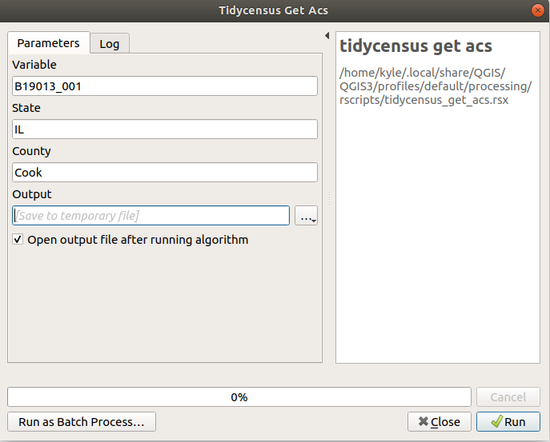

# [6.7 Working with software outside of R for cartographic projects](https://walker-data.com/census-r/mapping-census-data-with-r.html#working-with-software-outside-of-r-for-cartographic-projects)

The examples shown in this chapter display all maps within R. RStudio users running the code in this chapter, for example, will display static plots in the Plots pane, or interactive maps in the interactive Viewer pane. In many cases, R users will want to export out their maps for display on a website or in a report. In other cases, R users might be interested in using R and tidycensus as a “data pipeline” that can generate appropriate Census data for mapping in an external software package like Tableau, ArcGIS, or QGIS. This section covers those use-cases.

## 6.7.1 Exporting maps from R

Cartographers exporting maps made with **ggplot2** will likely want to use the `ggsave()` command. The map export process with `ggsave()` is similar to the process described in Section 4.2.3. If `theme_void()` is used for the map, however, the cartographer may want to supply a color to the bg parameter, as it would otherwise default to `"transparent"` for that theme.

The `tmap_save()` command is the best option for exporting maps made with **tmap**. `tmap_save()` requires that a map be stored as an object first; this example will re-use a map of Hennepin County from earlier in the chapter and assign it to a variable named `hennepin_map`.

```{r}
library(tidycensus)
library(dplyr)
library(tmap)

hennepin_race <- get_decennial(
  geography = "tract",
  state = "MN",
  county = "Hennepin",
  variables = c(
    Hispanic = "P2_002N",
    White = "P2_005N",
    Black = "P2_006N",
    Native = "P2_007N",
    Asian = "P2_008N"
  ),
  summary_var = "P2_001N",
  year = 2020,
  geometry = TRUE
) %>%
  mutate(percent = 100 * (value / summary_value))

hennepin_black <- filter(hennepin_race, 
                         variable == "Black")

hennepin_map <- tm_shape(hennepin_black) + 
  tm_polygons(col = "percent",
          style = "jenks",
          n = 5,
          palette = "Purples",
          title = "ACS estimate",
          legend.hist = TRUE) + 
  tm_layout(title = "Percent Black\nby Census tract",
            frame = FALSE,
            legend.outside = TRUE,
            bg.color = "grey70",
            legend.hist.width = 5,
            fontfamily = "Verdana")
```
That map can be saved using similar options to `ggsave()`. `tmap_save()` allows for specification of width, height, units, and dpi. If small values are passed to `width` and `height`, **tmap** will assume that the units are inches; if large values are passed (greater than 50), **tmap** will assume that the units represent pixels.

```{r}
tmap_save(
  tm = hennepin_map,
  filename = "~/images/hennepin_black_map.png",
  height = 5.5,
  width = 8,
  dpi = 300
)
```

Interactive maps designed with **leaflet** can be written to HTML documents using the `saveWidget()` function from the **htmlwidgets** package. A Leaflet map should first be assigned to a variable, which is then passed to `saveWidget()` along with a specified name and path for the output HTML file. Interactive maps created with `mapview()` are written to HTML files the same way, though the object to be saved will need to be accessed from the `map` slot with the notation `@map`, as shown below.

```{r}
library(htmlwidgets)
library(mapview)

dallas_bachelors <- get_acs(
  geography = "tract",
  variables = "DP02_0068P",
  year = 2020,
  state = "TX",
  county = "Dallas",
  geometry = TRUE
)

dallas_map <- mapview(dallas_bachelors, zcol = "estimate")

saveWidget(dallas_map@map, "dallas_mapview_map.html", selfcontained = T)
```

The argument `selfcontained = TRUE` is an important one to consider when writing interactive maps to HTML files. If `TRUE` as shown in the example, `saveWidget()` will bundle any necessary assets (e.g. CSS, JavaScript) as a base64-encoded string in the HTML file. This makes the HTML file more portable but can lead to large file sizes. The alternative, `selfcontained = FALSE`, places these assets into an accompanying directory when the HTML file is written out. For interactive maps generated with **tmap**, `tmap_save()` can also be used to write out HTML files in this way.

## 6.7.2 Interoperability with other visualization software

Although R packages have rich capabilities for designing both static and interactive maps as well as map-based dashboards, some analysts will want to turn to other specialized tools for data visualization. Such tools might include drag-and-drop dashboard builders like Tableau, or dedicated GIS software like ArcGIS or QGIS that allow for more manual control over cartographic layouts and outputs.

This workflow will often involve the use of R, and packages like **tidycensus**, for data acquisition and wrangling, then the use of an external visualization program for data visualization and cartography. In this workflow, an R object produced with **tidycensus** can be written to an external spatial file with the `st_write()` function in the **sf** package. The code below illustrates how to write Census data from R to a _shapefile_, a common vector spatial data format readable by desktop GIS software and Tableau.

```{r}
library(tidycensus)
library(sf)
options(tigris_use_cache = TRUE)

dc_income <- get_acs(
  geography = "tract", 
  variables = "B19013_001",
  state = "DC", 
  year = 2020,
  geometry = TRUE
)

st_write(dc_income, "dc_income.shp")
```

The output file `dc_income.shp` will be written to the user’s current working directory. Other spatial data formats like GeoPackage (`.gpkg`) and GeoJSON (`.geojson`) are available by specifying the appropriate file extension.

QGIS cartographers can also take advantage of functionality within the software to run R (and consequently **tidycensus** functions) directly within the platform. In QGIS, this is enabled with the [Processing R Provider plugin](https://north-road.github.io/qgis-processing-r/). QGIS users should install the plugin from the **Plugins** drop-down menu, then click **Processing > Toolbox** to access QGIS’s suite of tools. Clicking the R icon then **Create New R Script…** will open the R script editor.


```
##Variable=string
##State=string
##County=string
##Output=output vector
library(tidycensus)

Output = get_acs(
    geography = "tract",
    variables = Variable,
    state = State,
    county = County,
    geometry = TRUE
)
```

Tool parameters are defined at the beginning of the script with `##` notation. `Variable`, `State`, and `County` will all accept strings (text) as input, and the result of `get_acs()` in the tool will be written to `Output`, which is added to the QGIS project as a vector layer. Once finished, the script should be saved with an appropriate name and the file extension `.rsx` in the suggested output directory, then located from the R section of the Processing Toolbox and opened. The GIS tool will look something like the image below.


Fill in the text boxes with a desired ACS variable, state, and county, then click **Run**. The QGIS tool will call the user’s R installation to execute the tool with the specified inputs. If everything runs correctly, a layer will be added to the user’s QGIS project ready for mapping with QGIS’s suite of cartographic tools.


