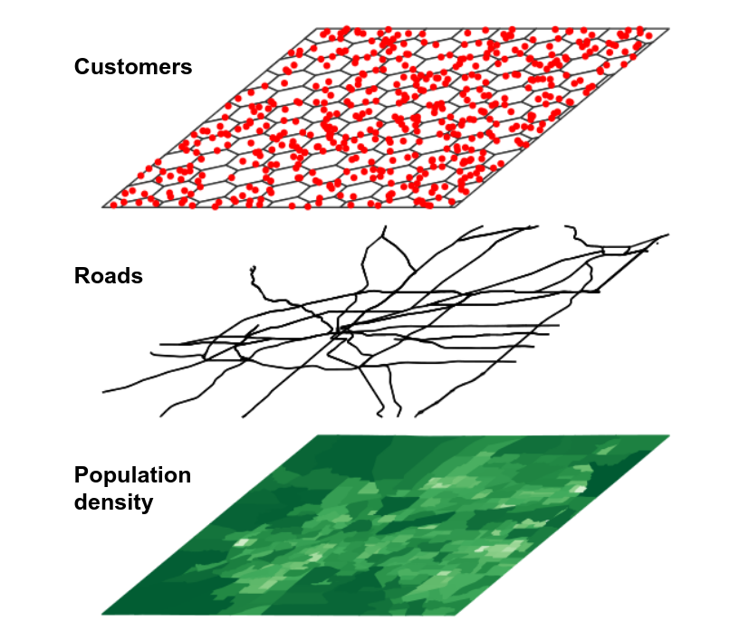

[7.1 Spatial overlay](https://walker-data.com/census-r/spatial-analysis-with-us-census-data.html#spatial-overlay)

Spatial data analysis allows practitioners to consider how geographic datasets interrelate in geographic space. This analytic functionality facilitates answering a wide range of research and analytic questions that would otherwise prove difficult without reference to a dataset’s geographic properties.

One common use-case employed by the geospatial analyst is spatial overlay. Key to the concept of spatial overlay is the representation of geographic datasets as layers in a GIS. This representation is exemplified by the graphic below:



In this representation, different components of the landscape that interact in the real world are abstracted out into different layers, represented by different geometries. For example, Census tracts might be represented as polygons; customers as points; and roads as linestrings. Separating out these components has significant utility for the geospatial analyst, however. By using spatial analytic tools, a researcher could answer questions like “How many customers live within a given Census tract?” or “Which roads intersect a given Census tract?”.

## 7.1.1 Note: aligning coordinate reference systems

In any workflow using spatial overlay, including all of the methods discussed in this chapter, it is essential that all layers share the same _coordinate reference systems_ (CRS) for overlay methods to work. More information about CRSs, consult section 5.4.

Spatial datasets obtained with **tigris** or **tidycensus** will by default share the same geographic CRS, NAD 1983. For geographic coordinate reference systems, the **sf** package uses the **s2** spherical geometry library to compute three-dimensional overlay rather than assuming planar geometries for geographic coordinates. This represents a significant technical advancement; however I have found that it can be much slower to compute spatial overlay operations in this way than if the same workflow were using a projected coordinate reference system.

In turn, a recommended spatial analysis data preparation workflow is as follows:

1. Download the datasets you plan to use in your spatial analysis;
2. Use `suggest_crs()` in the **crsuggest** package to identify an appropriate projected CRS for your layers;
3. Transform your data to the projected CRS using `st_transform()`;
4. Compute the spatial overlay operation.

To avoid redundancy, step 2 is implied in the examples in this chapter and an appropriate projected coordinate reference system has been pre-selected for all sections.

## 7.1.2 Identifying geometries withing a metropolitan area

One example of the utility of spatial overlay for the Census data analyst is the use of overlay techniques to find out which geographies lie within a given metropolitan area. Core-based statistical areas, also known as metropolitan or micropolitan areas, are common geographies defined by the US Census Bureau for regional analysis. Core-based statistical areas are defined as agglomerations of counties that are oriented around a central core or cores, and have a significant degree of population interaction as measured through commuting patterns. Metropolitan areas are those core-based statistical areas that have a population exceeding 50,000.

A Census data analyst in the United States will often need to know which Census geographies, such as Census tracts or block groups, fall within a given metropolitan area. However, these geographies are only organized by state and county, and don’t have metropolitan area identification included by default. Given that Census spatial datasets are designed to align with one another, spatial overlay can be used to identify geographic features that fall within a given metropolitan area and extract those features.

Let’s use the example of the Kansas City metropolitan area, which includes Census tracts in both Kansas and Missouri. We’ll first use **tigris** to acquire 2020 Census tracts for the two states that comprise the Kansas City region as well as the boundary of the Kansas City metropolitan area.

```{r}
library(tigris)
library(tidyverse)
library(sf)
options(tigris_use_cache = T)

# CRS used: NAD83(2011) Kansas Regional Coordinate System 
# Zone 11 (for Kansas City)

ks_mo_tracts <- list_rbind(map(
  c("KS", "MO"), ~{
    tracts(.x, cb = T, year = 2020)
  }
)) %>% 
  st_as_sf() %>% 
  st_transform(8528)

kc_metro <- core_based_statistical_areas(cb = TRUE, year = 2020) %>%
  filter(str_detect(NAME, "Kansas City")) %>%
  st_transform(8528)

ggplot() + 
  geom_sf(data = ks_mo_tracts, fill = "white", color = "grey") + 
  geom_sf(data = kc_metro, fill = NA, color = "red") + 
  theme_void()

```
We can see visually from the plot which Census tracts are _within_ the Kansas City metropolitan area, and which lay outside. This spatial relationship represented in the image can be expressed through code using _spatial subsetting_, enabled by functionality in the **sf** package.

## 7.1.3 Spatial subsets and spatial predicates

Spatial subsetting uses the extent of one spatial dataset to extract features from another spatial dataset based on co-location, defined by a _spatial predicate_. Spatial subsets can be expressed through base R indexing notation:

```{r}
kc_tracts <- ks_mo_tracts[kc_metro, ]

ggplot() +
  geom_sf(data = kc_tracts, fill = "white", color = "gray") +
  geom_sf(data = kc_metro, fill = NA, color = "red") +
  theme_void()
```
The spatial subsetting operation returns all the Census tracts that _intersect_ the extent of the Kansas City metropolitan area, using the default spatial predicate, `st_intersects()`. This gives us back tracts that fall within the metro area’s boundary and those that cross or touch the boundary. For many analysts, however, this will be insufficient as they will want to tabulate statistics exclusively for tracts that fall _within_ the metropolitan area’s boundaries. In this case, a different spatial predicate can be used with the `op` argument.

Generally, Census analysts will want to use the `st_within()` spatial predicate to return tracts within a given metropolitan area. As long as objects within the core Census hierarchy are obtained for the same year from **tigris**, the `st_within()` spatial predicate will cleanly return geographies that fall within the larger geography when requested. The example below illustrates the same process using the `st_filter()` function in **sf**, which allows spatial subsetting to be used cleanly within a tidyverse-style pipeline. The key difference between these two approaches to spatial subsetting is the argument name for the spatial predicate (`op` vs. `.predicate`).

```{r}
kc_tracts_within <- ks_mo_tracts %>% 
  st_filter(kc_metro, .predicate = st_within)

# Equivalent syntax:
# kc_metro2 <- kc_tracts[kc_metro, op = st_within]

ggplot() +
  geom_sf(data = kc_tracts_within, fill = "white", color = "gray") +
  geom_sf(data = kc_metro, fill = NA, color = "red") +
  theme_void()
```
