# [Ten Tips for Interpreting Economic Data](https://obamawhitehouse.archives.gov/sites/default/files/docs/07_23_15___interpreting_economic_data_third_way.pdf)

## Data is Noisy

### Look at Data With Less Volatility and Larger Samples

Some commentators—and even some economists—tend to focus too closely on individual monthly or weekly data releases. But economic data are notoriously volatile. In many cases, **a longer-term average paints a clearer picture, reducing the influence of less informative short-term fluctuations**.

For example: The [household employment survey](https://www.bls.gov/cps/) (BLS/Census Current Population Survey) samples only 60,000 households, whereas the [establishment employment survey](https://www.bls.gov/ces/) (BLS Current Employment Statistics) samples 588,000 worksites, representing millions of workers.

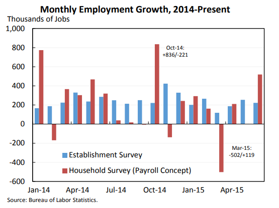

### Look Over Longer Periods

**Long-term moving averages can smooth out short-term volatility.** Over the past year, our businesses have added 240,000 jobs per month on average, more than the 217,000 per month added over the prior 12 months. The evolving moving average provides a less noisy underlying picture of economic developments.

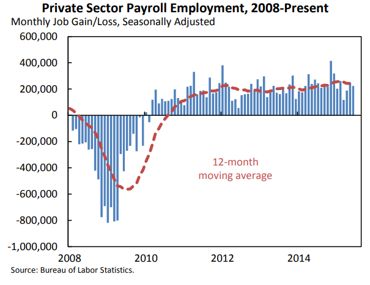

**One important example of the importance of long-run averaging is the number of new unemployment insurance claims filed each week.** Last week, there were only 255,000 new claims — the lowest figure in decades. Just two weeks before that, there were 296,000 claims, an especially high figure. However, the four-week average—a much more stable gauge—has remained essentially unchanged.

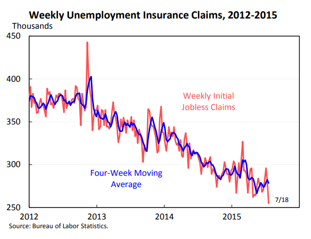

### Combine Different Measures of the Same Concept

**Some fluctuation in economic data results from the necessary imperfections of data collection**. Accordingly, one should **minimize such measurement error by holistically considering different measurements of similar concepts when possible.** 

For example: **There are more than a dozen measures of employee compensation data.** They all tell different stories. Some forecasters use econometric techniques to average them out and reduce measurement error.

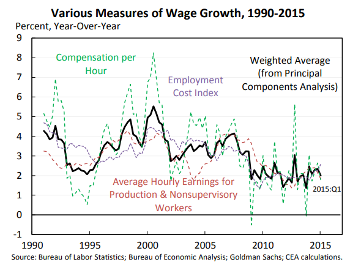

**The average of GDP and Gross Domestic Income (GDI) likely has less measurement error than either GDP or GDI.** GDP and GDI should be equal conceptually, but differ because of [measurement error](../../stats/surveys_and_polling/polling_concepts.md#error). Averaging both sources helps remove this error in principle — indeed, by this metric, output growth in 2015:Q1 was positive.

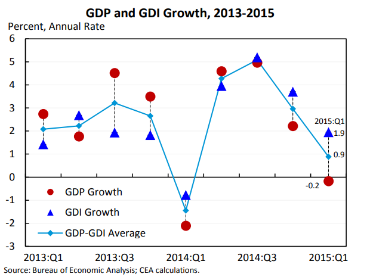

### Combine Mutliple Perspectives for Context

**Never look at a single indicator in a vacuum—it is important to consider contemporaneous measures of economic activity holistically.** Even when a particular piece of economic data is not especially volatile over time, its interpretation can be enhanced by other types of data that might paint a somewhat different picture.

For example: **GDP and employment reports sometimes tell very different stories about particular quarters.** In the first quarter of 2015, output growth slowed dramatically, but putting that report in the context of other economic growth indicators suggested that the first-quarter slowdown was not as large as GDP alone might imply.

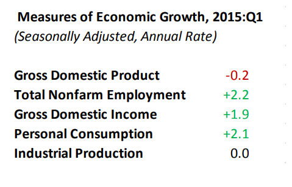

## Revisions

### Be Mindful of Revisions
**Most economic data get revised—sometimes frequently, and sometimes heavily.** Preliminary data releases, which can be based on estimates and incomplete source data, are not treated as final economic statistics. Employment and GDP reports, in particular, are subject to frequent revisions of sometimes substantial size. Revisions to 2015:Q1 were a case in point, with the original estimate showing slight output growth but subsequent estimates showing varying degrees of GDP contraction.

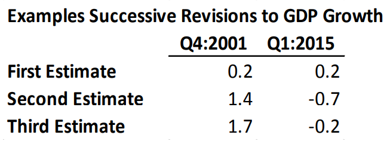

### But Not All Revisions Are Equal

For example: The first and third estimates of durable goods consumption, for example, are closely correlated, whereas the first estimate of real health spending provides little information about the third.

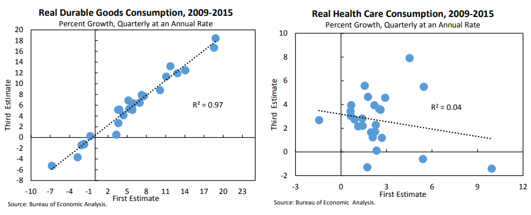

## Reality is Noisy

### Try to Extract Signal from the Noise

**Sometimes variation in headline economic data can be dominated by “noisy” components that tell us little about the economy’s underlying strength or its future path.** 

For example: For example, **inventory investment and net exports are small components of GDP that have little value for predicting future growth.** However, they are notoriously noisy, with their contributions to GDP growth varying wildly. Consumption contains much more predictive value about the future path of growth, and varies considerably less.

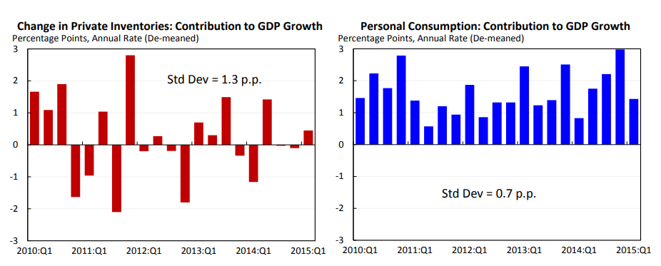

**Personal consumption and fixed investment—two components that together account for more than two thirds of GDP—have much more predictive value about future output.** The sum of these components—Private Domestic Final Purchases (PDFP)—explained 36% of the variance in next quarter’s GDP, versus only 22% explained by GDP itself. However, they are considerably more stable than inventory investment and net exports, so their contributions vary less and they explain less of overall GDP fluctuation than the more volatile components.

**Therefore, headline GDP growth is sometimes dominated by “noise” (changes in inventory investment and net exports) rather than “signal” (stable and persistent growth in consumption and fixed investment).**

## Understand the Tradeoff Between Timely/Noisy/Partial Data and Less Timely/More Complete Data

**Economists love trade-offs—even when deciding which data to review.** There is often a trade-off between the “timeliness” and long-term “macroeconomic value” of a data point. Sometimes, we accept a less informative data point because it is available sooner. While these “early releases” tend to move markets, they are often less useful for long-term analysis. For historical analysis, when we are less interested in the timeliness of a particular release, we tend to rely on other measures.

For example: **The ISM Manufacturing Survey provides one of the earliest looks at real economic activity in a given month.** It is a survey-based measure of whether manufacturing expanded or contracted in a given month— clearly conceptually inferior to actual measurements of economic activity, but available sooner.

**One of our most important gauges of middle-class well-being are median income data reported by the Census Bureau.** Though critical for long-term analysis, it is released nearly a year after its reference period.

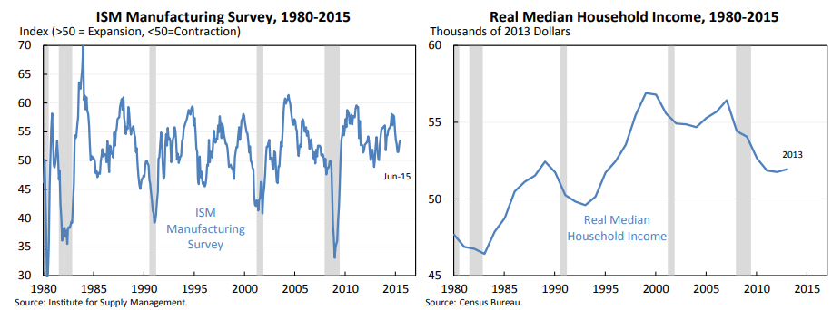

## Be Careful With Data that Has a Longer-run Trend
**A comparison of labor market metrics in 1955 and in 2009 illustrates this point.** 1955 was unequivocally a stronger year for the U.S. economy than 2009. In 1955, real GDP was growing upwards of 7 percent per year, whereas in 2009, we were just beginning to climb out of the depths of the worst financial crisis since the Great Depression.

**But in 2009, non-stationary labor market measures like e-pop and the labor force participation rate were actually better than in 1955.** The explanation is rooted in demographics, not economic strength: the working-age fraction of the population was much higher in 2009 than in 1955. (The baby boomers had not yet come of age in 1955). Accordingly, using such non-stationary measures as historical economic comparisons is not especially helpful.

***The more stationary unemployment rate, however, was considerably better in 1955 than 2009 — providing a much more reliable measure of underlying economic strength.***

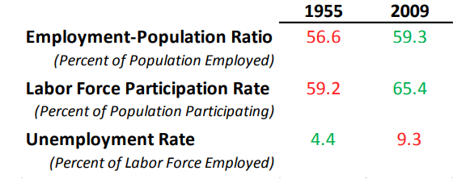

## Distinguish Real from Nominal Data

**It is always important to think about whether it makes sense to use nominal or real (inflation-adjusted) data.** Unless the overall level of prices is especially important for one’s economic analysis, it is often preferable to adjust historical time series for inflation. And nominal and real data often look very different.

For example: **Historical wage growth provides a key example.** If you are trying to assess living standards, an inflation adjustment is necessary. Hourly earnings for production and non-supervisory workers grew 8.6 percent in 1981 and only grew 2.3 percent in 2014—but that does not suggest that 1981 was a better year for workers than 2014. In fact, real wage growth was negative in 1981 because of the highinflation environment, but positive in 2014.

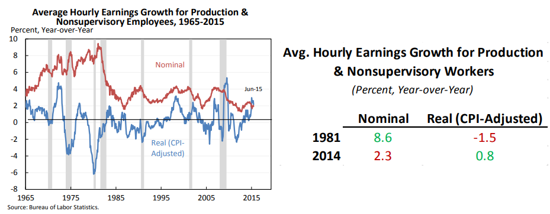

## Practical Tips for the Next GDP & Employment Reports

### Employment Situation (BLS)
* The establishment jobs number is the most timely, accurate picture of the
economy
* It’s not just about the most recent month: watch revisions to the previous two months — and the average for the last six months or a year
* The unemployment rate can rise/fall for good or bad reasons. See more at the [labor_force_definitions_and_flows.md](../labor_force_economics/labor_force_definitions_and_flows.md) file. 
* The participation rate is affected by both long-run trends and short-run cycles
* Look at wages adjusted for inflation (out later in the month) and in broader context

### Gross Domestic Product (BEA)
* *Watch the average of GDP and GDI for minimal measurement error, a new
publication from BEA
* Watch PDFP growth for a more informative signal about future economic growth
* Look at growth over the last four quarters, not just the last quarter.
