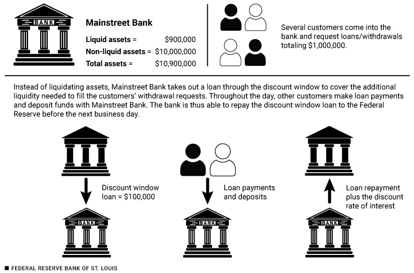
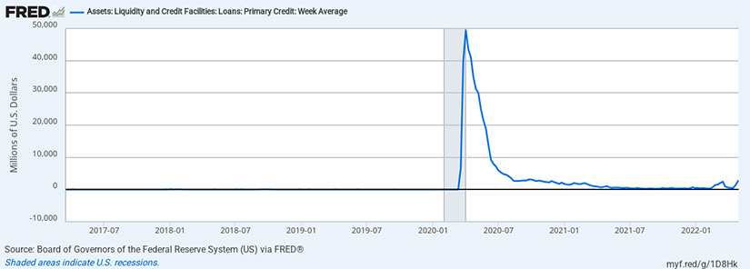

Prior to 2008, the Fed used open market operations as its primary tool for adjusting the federal funds rate. Today, the Fed uses interest on reserve balances as its primary tool. 

# A Closer Look at Administered Rates
When banks lend funds to other banks from these accounts, they earn the federal funds rate. When banks hold reserves at the Fed, they earn the interest on reserve balances rate. The Fed uses interest on reserve balances rate to steer the federal funds rate.

Banks hold funds and accounts at the Fed called **Reserve Balance Accounts**. When bank A needs to borrow funds it might borrow them from bank B if bank B has extra reserve balances in its Reserve Balance Accounts. When banks borrow from each other like this *it is just typically overnight*. The next day bank A returns the funds, plus a bit of interest, to bank B. These transactions occur in the **Federal Funds Market** and the interest rate banks agree to is the **Federal Funds Rate**.

On any given day there are many transactions in the federal funds market. These transactions settle at _slightly different_ federal funds rates. The **Effective Federal Funds Rate** measure the median rate of all these transactions. The FOMC sets the target range for where it wants this effective federal funds rate to be.

The Fed enforces this target rate with the **Interest on Reserve Balances** rate. The Fed pays interest on the reserve balances banks hold in their accounts at their regional federal reserve bank. For banks their reserve balance account offers a safe, risk-free, overnight investment option. If banks have excess funds, they can always deposit them in their reserve balance account and earn interest. This interest rate is a tool the FOMC uses to steer the federal funds rate in to the target range.

# Reservation Rate and Arbitrage
Banks can earn interest on their deposits at their federal reserve bank *or* they can earn interest by lending to other banks in the *federal funds market*. When banks hold funds in *reserve balance accounts* at the Fed, they earn the **Interest on Reserve Balances (IORB)** interest rate. When banks lend funds to other banks from their reserve balances accounts, they earn the **Federal Funds Rate** interest rate.

When banks have excess funds they look across these two options to decide the best place to invest in.

A **reservation rate** is the lowest rate of return that a bank is willing to accept for lending out its funds. There is no incentive for a bank to lend out it's funds (deposits) for anything less than what it can get from the Fed, which again is the *Interest on Reserve Balances (IORB)* rate. So, the interest on reserve balances rate serves as a reservation rate for banks.

With **arbitrage** — the simultaneous purchase and sale of funds (or goods) in order to profit from a difference in interest rates — the any gap between the *IORB* and the *Federal Funds Rate* will close through competition. Banks will borrow in the *Federal Funds Market* at the lower *Federal Funds Rate* and deposit that money borrowed in *with the Federal Reserve* to earn the higher *IORB* and thus make a profit. When an increasing number of banks want to *borrow in the Federal Funds Market*, the competition for loans increases and **lenders** in the federal funds market will start to charge a higher interest rate to lend money, thus pushing up the *Federal Funds Rate*. The Federal Funds Rate should rise to a level similar to the IORB, so that banks no longer have an incentive to borrow in the federal funds market and deposit with the Fed. ***This process also works in reverse when the Federal Reserve lowers the IORB***.

# Open for Business: Understanding the Fed's Discount Window
The phrase “lender of last resort” is often used in describing the Federal Reserve’s role in helping ensure banks and the broader financial system have access to cash and other forms of liquidity. Providing liquidity in this way [the discount window] is one of the original purposes of the Federal Reserve System and other central banks around the world.

Financial crises were the motivation driving Congress to pass the 1913 Federal Reserve Act to create the Federal Reserve System (the Fed). The Act specifically authorizes the Fed to lend to depository institutions when needed, to help them prevent these types of financial crises and **liquidity** failures.

The Board of Governors of the Federal Reserve System’s website states that “lending to depository institutions plays an important role in supporting the liquidity and stability of the banking system and effective implementation of monetary policy.”

## What is the Discount Window
The Fed is sometimes described as “a bank for banks.” This means the Fed offers services to depository institutions such as credit unions and banks, not unlike the way these depository institutions offer services to their customers. In this article, we’ll just use the word banks to describe all depository institutions.

For example, member banks can have accounts at their District Federal Reserve Bank. The funds in these accounts are called “reserves,” and the Fed pays banks interest on their reserves, just like customers at a regular bank receive interest on their accounts. Banks can also obtain short-term loans from the Fed’s “**discount window**” when they need funds for a short period of time. The interest the Fed charges for these loans is called the **discount rate**: It is one of the Fed’s administered rates and is a tool used to implement monetary policy.

The name discount window comes from the historic practice of banks sending representatives to Reserve Bank teller windows to access short-term loans. Today, banks do not need someone to physically go to a Reserve Bank to access this service.

## Why Would a Bank Need to Borrow Funds?
Banks make loans and in exchange receive interest payments, which they use to cover operating costs and to pay interest on customer deposits. Imagine that many people come into Mainstreet Bank at the same time to withdraw large amounts of money from their accounts. The bank has the assets to cover the withdrawals, but what if they do not have enough liquid assets to cover all these withdrawals? Cash is the most **liquid asset** and usually what customers expect to be paid in. Treasury securities are also considered liquid assets because they can be easily converted to cash with very little loss of value in the conversion process. On the other hand, **non-liquid assets** such as outstanding loans or real estate are more difficult to convert to cash without losing value in the conversion process.

The bank cannot pay its customers in non-liquid assets, so in this example the bank needs a short-term loan to cover these withdrawals. The bank can request a short-term loan from its District Federal Reserve Bank to cover the withdrawal requests; in exchange, the bank will pay the discount rate when it repays the loan. By borrowing from the Fed, the bank is able to relieve its temporary liquidity strain without having to sell its non-liquid assets.

## How Do These Loans Work?
For access to the discount window, banks must have active agreements on file with their District Federal Reserve Bank. These agreements include provisions ensuring that the bank is eligible to borrow and understands its obligations when taking out a discount window loan. When a bank makes a loan request, it must show that it has adequate **collateral**. Collateral comes in many forms, including loans or securities that could be seized if the borrower fails to repay.

Using our earlier example, imagine the many cash withdrawal requests total $1 million. The bank does not have $1 million in cash on hand, but it does have $10 million in real estate assets, such as mortgages. Non-liquid assets such as these could be hard to sell quickly to cover the withdrawals, but they could serve as collateral for a discount window loan for the bank from the Fed.

As banks receive funds from loan payments and deposits, they repay their discount window loans to the Fed, sometimes as quickly as within a few hours or overnight. These short-term loans allow banks to continue to service their customers without disruption. See Figure 1 below.

NOTE: By taking a short-term loan through the discount window, Mainstreet Bank is able to operate without delaying service to its customers or losing value by trying to convert its non-liquid assets into a liquid asset such as cash.

The Fed Board’s [website](https://www.federalreserve.gov/regreform/discount-window.htm) additionally states that “by providing ready access to funding, the discount window helps depository institutions manage their liquidity risks efficiently and avoid actions that have negative consequences for their customers, such as withdrawing credit during times of market stress. Thus, the discount window supports the smooth flow of credit to households and businesses.”

## The Discount Window During Financial Crisis
In normal times, when reserves are plentiful in the banking system, the Fed’s discount window is typically not very active. See Figure 2 below. However, the discount window plays a very important role in supporting liquidity and financial stability during times of crisis. For example, in 2020, banks turned to the discount window seeking liquidity as the economy reacted to the severe economic shock caused by the COVID-19 pandemic. To be clear, the Fed typically uses several strategies to provide liquidity to the financial system during times of crisis, but the discount window stands ready to provide banks with loans to meet their financial needs in normal times and during crises.

## The Discount Window as a Monetary Policy Tool
So far, we’ve described how banks can borrow funds from the Fed’s discount window to meet short-term liquidity needs, but banks can also borrow reserves from each other to meet liquidity needs. The interest rate that banks pay to borrow reserves from other banks is called the federal funds rate. The federal funds rate is determined in the market by the supply and demand for reserves. It plays an important part in the monetary policy process: The Federal Open Market Committee (FOMC) sets a target range in which it wants the federal funds rate to fall; in setting this range the Fed communicates its monetary policy position. When the Fed lowers the target range it pulls other interest rates down, making borrowing more affordable for consumers and businesses, which can give economic activity a boost during a downturn. Or, the Fed can raise the federal funds rate target range, pushing interest rates higher and decreasing the demand for goods and services when inflation is too high.

The discount rate plays an important role in keeping the federal funds rate near the Fed’s target. Ihrig, Weinbach, and Wolla stated in their [2022 article](https://www.tandfonline.com/doi/full/10.1080/09538259.2022.2040906), “Because banks will likely not borrow from others at a much higher rate than they can borrow from the Fed, the discount rate helps to curb any upward spikes in the federal funds rate.”
