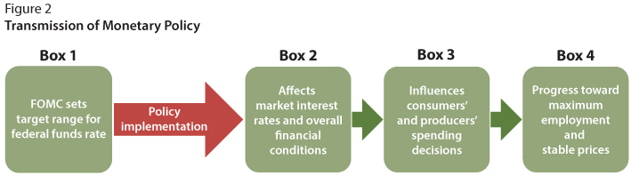
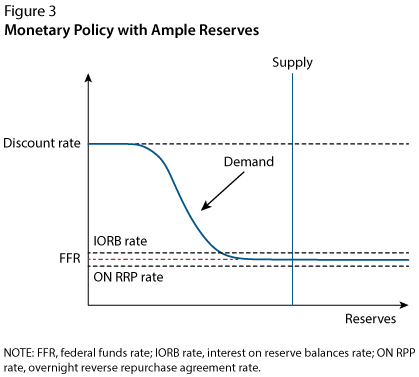
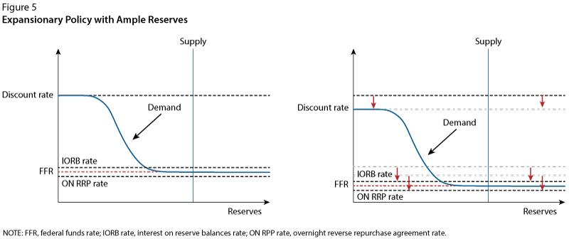

# How Does the Fed Use Its Monetary Policy Tools to Influence the Economy?

The Federal Reserve sets two overnight interest rates: the interest rate paid on banks' reserve balances and the rate on our reverse repurchase agreements. The Fed uses these two administered rates to keep a market-determined rate, the federal funds rate, within a target range set by the FOMC.

The **federal funds rate** is the interest rate banks charge each other for overnight loans. The Fed sets a target range for where it wants the interest rates charged to fall within, and it is the setting of this range that the Fed uses to communicate its monetary policy position.

# What Is the Federal Funds Rate and Why Is It So Important?
The federal funds rate is a very specific short-term interest rate. It involves the transfer of funds between banks that maintain accounts (deposits) with their Federal Reserve Bank; the accounts are called **reserve balance** accounts. The **federal funds market** is *where banks that may need money in their reserve accounts for cashflow reasons go to borrow from banks that have excess funds in their reserve accounts*. Banks who lend funds act as suppliers of reserves in the federal funds market; banks who borrow funds act as demanders of reserves in the federal funds market. The federal funds rate is not "set" by the Fed, but rather determined by the borrowers and lenders in the federal funds market.

Monetary policy is transmitted through market interest rates to affect consumers' and producers' spending decisions, which ultimately moves the economy toward the Fed's objectives—maximum employment and stable prices. This monetary policy implementation framework ensures that when the FOMC changes its policy stance (raises or lowers the target range for the federal funds rate), market interest rates and financial conditions move in the desired direction.

The FOMC conducts monetary policy by setting the target range for the federal funds rate (Figure 2, Box 1). Then the Fed implements policy by using its monetary policy tools to ensure the federal funds rate stays within the target range (red arrow).

The federal funds rate is important because when the FOMC sets its target range, it influences many other interest rates in the economy (Figure 2, Box 2). In fact, by adjusting the target for this rate, the Fed can influence the spending choices of consumers and producers (Figure 2, Box 3) and ultimately move the economy toward maximum employment and price stability (Figure 2, Box 4).

# The Fed's Monetary Policy Implementation Toolbox
The Fed uses its monetary policy tools in the implementation phase. In all, the Fed uses **four** key tools to help ensure the federal funds rate stays within the target range set by the FOMC. We'll use a simple supply and demand model (Figure 3) to describe how the tools work together. Overall, these are the critical tools the Fed uses because reserves in the banking system are ample. That is, the supply of reserves, set by the Fed, is large enough that it intersects the demand curve where it is nearly flat (see Figure 3).

In the ample-reserves framework, the Federal Reserve raises (lowers) its administered rates to move the federal funds rate higher (lower). Small shifts of the supply curve have little or no effect on the federal funds rate.

# The Fed's Primary Tool: Interest on Reserve Balances
Today, the Fed's primary tool for adjusting the federal funds rate is interest on reserve balances. The interest on reserve balances rate (labeled "IORB rate" in Figure 3) is the interest rate paid on funds that banks hold in their reserve balance account at a Federal Reserve Bank. For banks, this interest rate represents a risk-free investment option. Importantly, the *interest on reserve balances rate is an "administered rate,"* which means **it is set by the Fed and not determined in a market** (like the federal funds rate is). In fact, there are two key concepts that ensure interest on reserves is an effective tool.

The first concept is the **reservation rate**, which is *the lowest rate that banks are willing to accept for lending out their funds*. Banks can deposit their funds at the Federal Reserve and earn the interest on reserve balances rate. Because depositing funds at the Fed is a risk-free option, banks will likely not be willing to lend their funds in the federal funds market for a lower interest rate than they can earn from depositing their funds at the Fed. So, the interest on reserve balances rate serves as a reservation rate for banks.

The second concept is **arbitrage**, which is the simultaneous purchase and sale of funds (or goods) in order to profit from a difference in price. For example, let's assume reserves are trading in the federal funds market at 2 percent (i.e., the federal funds rate is 2 percent) and that reserves (deposits) at the Fed earn 2.5 percent (i.e., the interest on reserve balances rate is 2.5 percent). Banks will quickly see that they can borrow funds in the federal funds market at 2 percent and deposit those funds at the Fed and earn the interest on reserve balances rate of 2.5 percent, which means that they can earn a profit of 0.5 percent (the difference between the rates). The increase in demand for funds in the federal funds market will put upward pressure on the federal funds rate, and the federal funds rate will rise toward the interest on reserve balances rate. This upward pressure on the federal funds rate will continue until the federal funds rate has risen to the level that banks no longer see the opportunity to profit.

*So, arbitrage ensures that the federal funds rate does not fall far below the interest on reserve balances rate*. Arbitrage is the reason why these short-term rates remain closely linked. In fact, arbitrage is what makes interest on reserve balances an effective tool for guiding the federal funds rate. Because the Fed sets the interest on reserve balances rate directly, the Fed can steer the federal funds rate down or up by lowering or raising the level of the interest on reserve balances rate. As a result, *interest on reserve balances is the Fed's primary tool for adjusting the federal funds rate*, but the Fed has other tools that play supporting roles.

# Setting a Floor for the Federal Funds Rate: The Overnight Reverse Repurchasing Agreement Facility
Interest on reserve balances is available only to banks and a few other institutions. The Fed has an overnight reverse repurchase **facility** that is open to a broader set of financial institutions. This facility allows these financial institutions to deposit their funds at a Federal Reserve Bank and earn the overnight reverse repurchase agreement rate offered by the Fed. The overnight reverse repurchase agreement rate (labeled "ON RRP rate" on Figure 3) works for these institutions similar to the way the interest on reserve balances rate works for banks. So, this rate acts like a reservation rate for these financial institutions, and the overnight reverse repurchase agreement rate interacts with other short-term market rates through arbitrage. The overnight reverse repurchase agreement facility is a supplementary tool because the rate the Fed sets for it helps set a floor for the federal funds rate.

# Setting a Ceiling for the Federal Funds Rate: The Discount Window
The **discount rate** is the rate charged by the Fed for loans obtained through the Fed's **discount window**. Because banks will not likely borrow at a higher rate than they can borrow from the Fed, the discount rate acts as a ceiling for the federal funds rate: It is set higher than the interest on reserve balances rate and the overnight reverse repurchase agreement rate (Figure 5).

When the Federal Reserve lowers its administered rates, the end points of the demand curve shift down. The vertical supply curve is unchanged. The demand curve intersects the supply curve at a lower federal funds rate. In general, the Fed tends to lower all the administered rates by the same amount, keeping the spread between the rates constant.

# The Final Tool: Open Market Operations
As noted above, the Fed's current method for implementing monetary policy relies on banks' reserves remaining "ample." So, if the Fed needs to add reserves to ensure they remain ample, it does so by buying U.S. government securities in the open market. This action is known as open market operations. When the Fed buys securities, it pays for them by depositing funds into the appropriate banks' reserve balance accounts, adding to the overall level of reserves in the banking system. As Figure 3 shows, open market operations can be used to shift the supply curve left or right. Prior to 2008, open market operations were the Fed's primary monetary policy tool, which it used daily to make sure the federal funds rate hit the FOMC's target. Today this tool is mainly used to ensure that reserves remain ample.

Now that you understand the Fed's implementation tools, let's see how the Fed uses them to achieve its two goals: maximum employment and price stability.

# Expansionary Monetary Policy Using the Fed's Tools
Suppose the following: The economy weakens, with employment falling short of maximum employment, and the inflation rate has been steady at around 2 percent but is showing signs of decreasing. The FOMC might decide to conduct monetary policy by lowering its target range for the federal funds rate. To implement that monetary policy, it would decrease its administered rates — the interest on reserve balances rate, overnight reverse repurchase agreement rate, and discount rate—to ensure the market-determined federal funds rate stays within the target range (see Figure 5). These actions would transmit to other interest rates and broader financial conditions:

* Lower interest rates decrease the cost of borrowing money, which encourages consumers to increase spending on goods and services and businesses to invest in new equipment.
* The increase in consumption spending increases the overall demand for goods and services in the economy, which creates an incentive for businesses to increase production, hire more workers, and spend more on other resources.
* As these increases in spending ripple through the economy, likely moving the unemployment rate down toward its full employment level, inflation could possibly move up.

So, the Fed's monetary policy implementation tools can be effective for moving the economy back toward maximum employment and price stability when the economy is stalling.

# Contractionary Monetary Policy Using the Fed's Tools
Suppose the following: The economy is showing signs of overheating, with the unemployment rate very low and businesses finding it hard to fill jobs, and the inflation rate has been above the Fed's 2 percent target for quite some time and is rising. In this case, the FOMC might decide to conduct monetary policy by raising its target range for the federal funds rate. To implement that monetary policy, it would increase its administered rates—the interest on reserve balances rate, overnight reverse repurchase agreement rate, and discount rate—to ensure the federal funds rate stays within the target range. These actions would transmit to other interest rates and broader financial conditions:

* Higher interest rates increase the cost of borrowing money and raise the incentive to save, which dampens consumer spending on some goods and services and slows businesses' investment in new equipment.
* The decrease in consumption spending decreases the overall demand for goods and services in the economy, which will likely lead to a decrease in production levels, fewer employees hired, and less spending on other resources.
* As these decreases in spending ripple through the economy, demand for workers could lessen, inflationary pressures would diminish, and the inflation rate would fall back toward 2 percent.

So, higher interest rates can be used to move the economy back to maximum employment and price stability when the economy is overheating.

