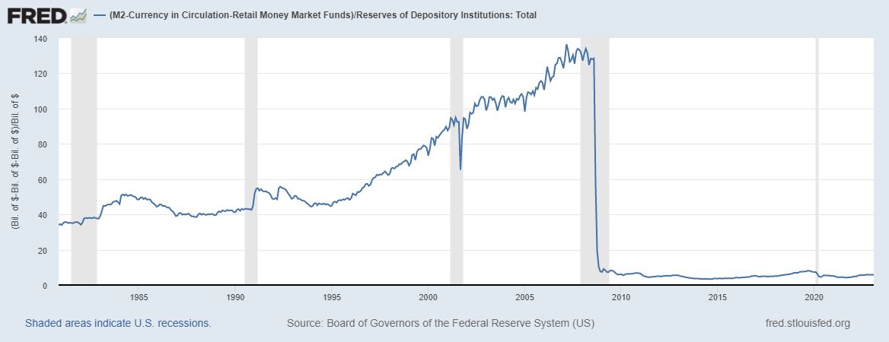

Changes to monetary policy since the Great Financial Crisis have not been reflected in textbooks at this point. The outdated textbooks tend to focus on the money multiplier, describing how money expands and contracts in the economy and tying the Fed's tool of reserve requirements into their discussions of bank lending. They essentially argue that banks would lend more if they did not have to hold back funds to meet their Fed-determined reserve requirements. So, in explaining bank lending, these textbooks use a concept called the money multiplier, which depicts a strict linkage between banks, the Fed, and the money supply. This outdated concept is represented by a simple equation that describes the maximum increase in money (deposits) that is created in the economy from each additional dollar loaned by banks: 

$\text{Money multiplier} = \frac{1}{RR}$

where "RR" is the reserve requirement ratio set by the Fed. The equation shows how the amount of money (deposits) banks "create" is a fraction of the reserve requirement ratio set by the Fed. For example, if a bank subject to a 10 percent reserve requirement lent an additional $100 of funds, $1,000 (or 100 × 1/0.10) in total would ultimately be added to the money supply. In this case, reserves in the banking system would create 10 times as many deposits. And if instead the reserve requirement ratio were 5 percent, $2,000 (or 100 × 1/0.05) of money (deposits) would be created for each additional $100 of loans made by the bank. In this case, additional reserves would create 20 times as many deposits. This focus on fractional reserves suggest that reserve requirements can be a powerful monetary policy tool of the Fed, ***yet reserve requirements are not currently used in this way***. 

Knowing how the Fed's operations have changed, we can readily see why the money multiplier no longer applies. First, banks still make loans with profits, risks, and regulatory considerations firmly in mind, but with the Fed keeping reserves in the banking system consistently ample, meeting reserve requirements is not one of those considerations. Second, even during the period when reserves were limited, many banks had not been constrained by reserve requirements for quite some time. Third, the Fed eliminated reserve requirements in March 2020—it set reserve requirement ratios ("RR" in the equation above) to zero—reflecting the fact that reserve requirements have no essential role in an ample-reserves regime. So, mathematically, the money multiplier equation is literally no longer definable.

The FRED graph above shows the ratio of [M2](https://www.federalreserve.gov/faqs/money_12845.htm) deposits to reserve balances. The ratio should be stable, or at least approximately so, if the money multiplier concept is valid. Instead, the figure shows the ratio trended up noticeably during the 1990s, starting the decade at a reading of around 40 and increasing to around 80 by 2000. One reason for this increase is the prevalence of retail sweep programs, a systematic way of avoiding reserve requirements, in the banking system. Beginning in the early 1990s, banks used computer programs to “sweep” (shift) customers’ funds overnight from accounts that were subject to reserve requirements to accounts that were not (all the while ensuring customers had full access to their funds). As a result, many banks, including most large banks, were consistently not constrained by reserve requirements for many years.

More recently, with the onset of the Global Financial Crisis of 2007-09, the ratio dropped to near zero. This decline reflected reserve balances ballooning quickly as the Fed injected substantial liquidity into the banking system to help stabilize financial markets. Subsequently, the Fed implemented multiple rounds of asset purchases to support economic recovery, which kept the ratio low.

Going forward, with the Fed maintaining ample reserves, it is unlikely that the ratio will have the same meaning as it had in the past. Moreover, we know the level of reserves can swing substantially at times when the Fed needs to use its balance sheet tool to help meet its dual mandate. Given these facts, the money multiplier is an outdated concept.