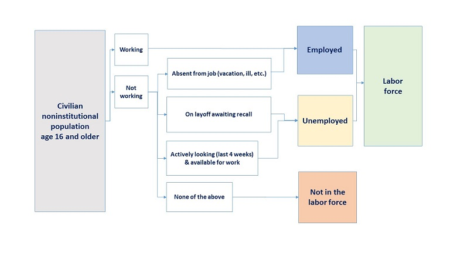

# Definitions
The Russian nesting doll relationship of different populations in the economic lens:

1. The [civilian noninstitutional population](https://www.bls.gov/cps/definitions.htm#population): population age 16 and older is the base population group, or universe, used for Current Population Survey (CPS) statistics published by BLS.

This excludes:
* active duty members of the U.S. Armed Froces
* people confined to, or living in, institutions or facilities such as:
    * prisons, jails, and other correctional institutions and detention centers
    * residential care facilities such as skilled nursing homes

This includes citizens of foreign countries who reside in the United States but do not live on the premises of an embassy.

2. The [civilian labor force](https://www.bls.gov/cps/definitions.htm#laborforce), or labor force: includes all people age 16 and older who are classified as either employed and unemployed, as defined below. Conceptually, the labor force level is the number of people who are either working or actively looking for work.

3. In the Current Population Survey (CPS), people are classified as employed if, during the survey [reference week](https://www.bls.gov/cps/definitions.htm#refweek), they meet **any** of the following criteria:

* worked at least 1 hour as a paid employee (see wage and salary workers)
* worked at least 1 hour in their own business, profession, trade, or farm (see self-employed)
* were temporarily absent from their job, business, or farm, whether or not they were paid for the time off (see with a job, not at work)
* worked without pay for a minimum of 15 hours in a business or farm owned by a member of their family (see unpaid family workers)

For criteria 1 and 2, the work must be for pay or profit; that is, the individual receives a wage or salary, profits or fees, or payment in kind (such as housing, meals, or supplies received in place of cash wages). For the self-employed, this includes those who intended to earn a profit but whose business or farm produced a loss.

Each employed person is counted only once in aggregate employment statistics from the CPS, even if they hold more than one job.

This means that people who are **employed** are either people from the civilian noninstitutional population age 16 and older who are _working_ or _not working_ but absent from their job (vacation, ill, etc.)

4. In the Current Population Survey, people are classified as [unemployed](https://www.bls.gov/cps/definitions.htm#unemployed) if they meet **all** of the following criteria:
* They were not employed during the survey reference week.
* They were available for work during the survey reference week, except for temporary illness.
* They made at least one specific, active effort to find a job during the 4-week period ending with the survey reference week (see [active job search methods](https://www.bls.gov/cps/definitions.htm#jobsearch)) OR they were temporarily laid off and expecting to be recalled to their job.

Active job search methods are defined as those that have the potential to result in a job offer without any further action on the part of the job seeker. Examples of active job search methods include:

* contacting an employer directly about a job
* having a job interview
* submitting a resume or application to an employer or to a job website
* using a public or private employment agency, job service, placement firm, or university employment center
* contacting a job recruiter or head hunter
* seeking assistance from friends, relatives, or via social networks; for example, asking friends and family for job leads or indicating one's job seeking status on social media
* placing or answering a job advertisement
* checking union or professional registers

This means that people who are **unemployed** are either people from the civilian noninstitutional population age 16 and older who are _not working_ **and** either on layoff awaiting recall or actively looking (last 4 weeks) & available for work.

5. In the Current Population Survey, people are classified as [not in the labor force](https://www.bls.gov/cps/definitions.htm#nilf) if:

* they were not employed during the survey reference week **and**
* they had not actively looked for work (or been on temporary layoff) in the last 4 weeks

In other words, people not in the labor force are those who do not meet the criteria to be classified as either employed or unemployed, as defined above.

People who are not in the labor force can be further broken down as below:

[People who want a job now](https://www.bls.gov/cps/definitions.htm#wantajob)
* These individuals are not currently working and have not looked for work in the last 4 weeks. Because they have not actively looked for work in the last 4 weeks, they are not classified as unemployed. People who want a job now answered "yes" when asked "Do you currently want a job, either full or part time?" They also are asked questions about their job search activities in the last 12 months and whether they were available to start a job during the survey reference week. BLS publishes monthly estimates of the number of people who want a job now and the number who don't. These estimates include some survey respondents who were not actually asked the "want a job" question; their desire for work is inferred from their responses to other survey questions.
    * [Marginally attached to the labor force](https://www.bls.gov/cps/definitions.htm#marginallyattached): In response to survey questions, people marginally attached to the labor force indicate that they have searched for work during the prior 12 months (or since their last job if it ended within the last 12 months), but not in the most recent 4 weeks. Because they did not actively search for work in the last 4 weeks, they are not classified as unemployed. In other words, the marginally attached are people who say they want a job, but who have recently stopped looking for work. People marginally attached to the labor force also must have been available to take a job during the survey reference week, unless they were temporarily ill. Specifically, they are asked "Last week, could you have started a job if one had been offered?"
        * [Discouraged workers](https://www.bls.gov/cps/definitions.htm#discouraged): Discouraged workers are not classified as unemployed because they have not actively searched for work in the last 4 weeks. *Discouraged workers are not counted among the unemployed.* When asked, "What is the main reason you were not looking for work during the last 4 weeks," these individuals indicate some type of discouragement about their job prospects. Their specific responses vary, but common ones include the following:
            * There are no jobs available, or none for which they would qualify.
            * They have been unable to find work in the past.
            * They lack the education, training, or experience needed for available jobs.
            * Employers think that they are too young or too old, or they are subject to some other type of discrimination.
        * [Other people marginally attached to the labor force](https://www.bls.gov/cps/definitions.htm#othermarginal): When asked, "What is the main reason you were not looking for work during the last 4 weeks," these individuals gave a reason other than discouragement about their job prospects. Common reasons for no recent job search given by people in this group include:
            * family responsibilities
            * in school or training
            * ill health or disability
            * childcare problems

# Metrics
* [Labor force participation rate](https://www.bls.gov/cps/definitions.htm#lfpr): The labor force participation rate represents the number of people in the labor force as a percentage of the civilian noninstitutional population. In other words, the participation rate is the percentage of the population that is either working or actively looking for work. The labor force participation rate is calculated as: (Labor Force / Civilian Noninstitutional Population) x 100.

* [Employment-population ratio](https://www.bls.gov/cps/definitions.htm#epop): The employment-population ratio represents the number of employed people as a percentage of the civilian noninstitutional population. In other words, it is the percentage of the population that is currently working. The employment-population ratio is calculated as: (Employed / Civilian Noninstitutional Population) x 100.

* [Unemployment rate](https://www.bls.gov/cps/definitions.htm#ur): The unemployment rate represents the number of unemployed people as a percentage of the labor force (the labor force is the sum of the employed and unemployed). The unemployment rate is calculated as: (Unemployed / Labor Force) x 100.

* Employment rate: The employment rate represents the number of employed people as a percentage of the labor force (the labor force is the sum of the employed and unemployed). The employment rate is calculated as: (Employed / Labor Force) x 100.

# Concepts

Think of the labor force like [a bathtub](https://libertystreeteconomics.newyorkfed.org/2012/03/the-bathtub-model-of-unemployment-the-importance-of-labor-market-flow-dynamics.html). There are people who can enter the labor force from not being in the labor force by either getting a job or starting to look for a job but remaining unemployed. There are people who can exit the labor force by either retiring, ceasing active searching for employment, or a few other cases.

Labor supply can expand through two different mechanisms: by workers coming back into the labor force (a rise in labor force entry), or by a stem in the flow of workers leaving the labor force (a fall in labor force exit).

More info [here](https://www.employamerica.org/researchreports/participation-and-the-hot-labor-market/) from Ernie Tedeschi Employ America

