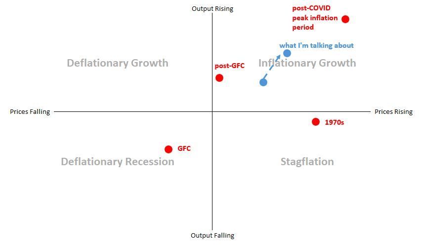
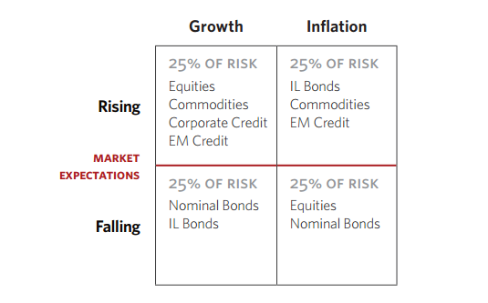

Higher inflation doesn't necessarily mean weaker real growth. Here is a common four-quadrant look at the economy with price change on one axis and output change on the other.

This is a different spin on the Ray Dalio balanced investment portfolio model, pictured below:

