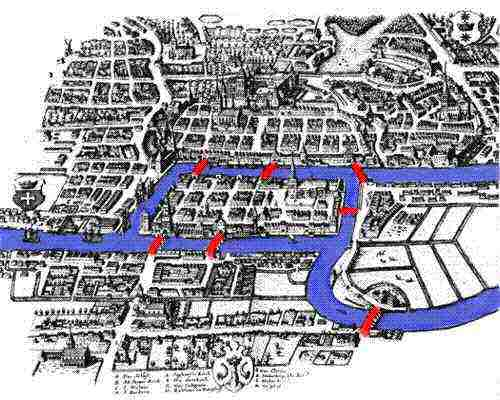
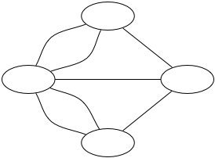
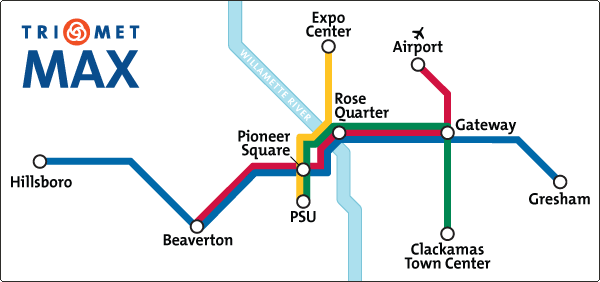
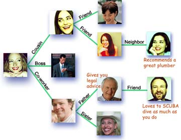
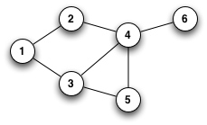
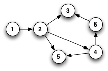
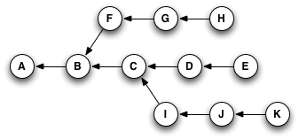

# Graph Theory
A graph refers to a collection of nodes and a collection of edges that connect pairs of nodes. Graph theory can be used to describe a lot of things, but I'll start off with one of the most straightforward examples: maps. You can think of graph theory as a way of encoding information about two aspects of a map: **places to go, and ways to get there**.

Here's a drawing of the city of Königsberg, Prussia in the early 18th century.

The city was set on both sides of the Pregel River (shown in blue), and included two large islands which were connected to each other and the mainland by seven bridges (shown in red). Someone had posed the question of whether it was possible to walk through the city and cross every bridge exactly once.

In 1735, a mathematician named Leonhard Euler proved that such a route could not exist. In doing so, he basically invented a field of mathematics, which we now call graph theory.

Euler's version

If all you're concerned with is which bridges you cross, then for all intents and purposes, each land mass can be represented by a point, and each bridge is just a line between two points. Which is why I say you can think of graph theory as the study of places to go, and ways to get there.

**Nodes**: Places to be
**Edges**: Ways to get there

# Attaching Labels to Nodes

While mathematicians may be perfectly content to consider graphs only according to their shapes, most programmers and computer scientists tend to use them to compute some kind of meaningful results.

As such, it's often useful to label the nodes in a graph in some way. For example, here in lovely Portland, Oregon, we love us some public transit. We've got buses, light rail, commuter rail, streetcars, and even an aerial tram.

Here's a quick overview of just our light rail system. This doesn't show all the stops—pardon me, nodes—it's just the transfer points and end stations for each line. The nodes have labels that make them mean something to humans, but as far as a computer is concerned, they could just be called "01100010".

Portland's light rail: the 10,000-foot view

...and if, right about now, you're starting to open your mouth and say, "hey, why are those lines different colors?" Then you, my friend, are on the right track. (No pun intended.)

# Attaching Labels to Edges

Just as we can label the nodes in a graph, we can also attach information to the edges. This might include:

* **Names**—for example, "12th Avenue".
* **Numbers (also called "weights")**—like distances or speeds.
* **Types**—to denote relationships, like "friend" or "coworker" or "parent of".
* **Direction**—in the previous example, relationships like "friend" and "coworker" are bidirectional, but "parent of" only goes one way (unless, possibly, you're a character in a Robert A. Heinlein novel).

A social network.

# Directed Versus Undirected Graphs

One of the key distinctions people make between graphs is whether they are **directed** or **undirected**. All this means is whether the edges in a graph are bidirectional or not.

Undirected graph (no arrows)

Directed graph (arrows)

# Reachability
You can think of the below graph as a **set of three parallel universes** with **time flowing from left to right**, so that _A_ is the beginning of recorded history. The arrows represents the "follows" or "is subsequent to" relationship, so you might say that "B follows A".

To see an ASCII version of this graph, type `git rebase --help`

If you start from **E**, the history you'll see is **A, B, C, D, E**.
If you start from **H**, the history you'll see is **A, B, F, G, H**.
If you start from **K**, the history you'll see is **A, B, C, I, J, K**.

But the really important thing about this is that no matter which node you start with, **some parts of the graph will be unreachable to you**.

That sounds kind of pessimistic, so I'll turn it around: **Depending on where you start, you can reach parts of the graph that you couldn't get to otherwise**.

This may not sound like much, but stay with me for a little while longer—it's huge.