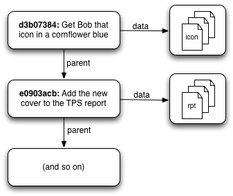
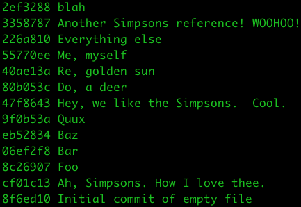
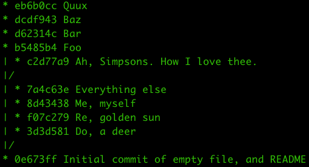
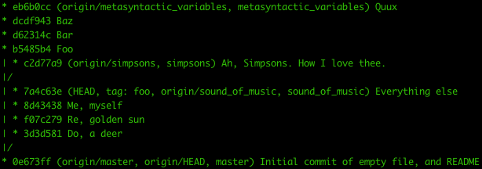
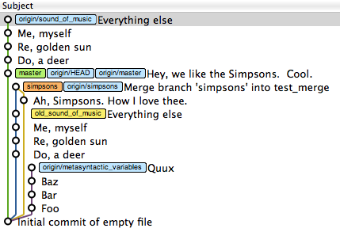
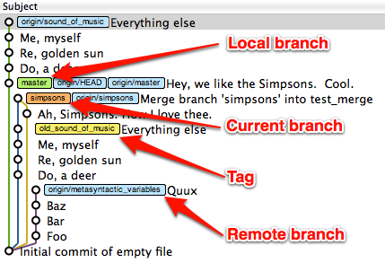

# Graphs and Git
The reason I've gone on at some length about graph theory is that a Git repository is one giant graph.

Most of the time when you interact with Git, you're working with commits in one way or another. At the surface level, a Git commit consists of two things: (1) a pointer to the state of your code at some moment in time, and (2) zero or more pointers to "parent" commits. 

_Hint: the word "pointer" means you're probably talking about a graph._

**A Git commit is a node in a graph**, and each one of those nodes can point to other nodes that came before them.

Git commits (simplified view)

By the way: if you want to learn way more about this than any reasonable human should ever know, I highly recommend Scott Chacon's ["Git Internals" PDF](https://github.com/pluralsight/git-internals-pdf/releases). Scott's knowledge of Git is... impressive.

# Visualizing Your Git Repository
About half of my interactions with Git take place on the command line. But **when I want to understand what's going on, I use a visual Git tool**. I still use [GitX](https://rowanj.github.io/gitx/), but in the years since I first wrote this site, several other tools have been released. Use whatever works for you. There is [GitHub Desktop](https://gist.github.com/berkorbay/6feda478a00b0432d13f1fc0a50467f1) and [GitKraken](https://www.gitkraken.com/) and others [here](https://www.tecmint.com/best-gui-git-clients-git-repository-viewers-for-linux/).

The main point of using a visualizer is to **help you make sense of your branch history**. For example, to list all commits in your repository at the command line, you could do `git log --oneline --abbrev-commit --all` (`pretty=oneline --branches=*` and be shortened to `--oneline --all`)—which will get you this flattened view:

Or, you can add `--graph` to that command, which will show you a _slightly_ more useful view:

If you want to see branch and tag labels, add `--decorate`:

`git log --oneline --abbrev-commit --all --graph --decorate`

You can also add `--color` to pretty up the display a bit more

`git log --oneline --abbrev-commit --all --graph --decorate --color`

And, in fact, I have a shell alias in my [dotfiles repository](https://github.com/geeksam/dotfiles/blob/master/bash/aliases) that does all of this:
`alias gg='git log --oneline --abbrev-commit --all --graph --decorate --color'`

Or, you can set up a Git alias to do the same thing:
`git config --global alias.graph "log --graph --oneline –decorate=short"`

But mostly, I just use GitX, which shows all of the same information in a cleaner graphical view:

# References

**References are pointers to commits**

References come in several flavors: _local branch_, _remote branch_, and _tag_.

On disk, a ***local branch reference*** consists entirely of a file in your project's .git/refs/heads directory. This file contains the 40-byte identifier of the commit that the reference points to... and that's it. **The entire file is 40 bytes**.

You might have heard people talk about how Git allows "cheap branching." This is (part of) what they mean. Creating a branch in Git just means writing 40 bytes to disk, which is why `git branch foo` is so freaking fast.

# The Reference Reference
As previously mentioned, there are a few different kinds of references, and they all point to commits in your repository. The only difference between them is how and when they move. (When I say that a reference moves, I mean that the ID of the commit that it points to is updated.)

**Local branch references** are specific to a single repository: your local one. Commands that affect local branch references include `commit`, `merge`, `rebase`, and `reset`.

**Remote branch references** are also specific to a single repository, but one that's previously been defined as a remote. Commands that affect remote branch references include `fetch` and `push`.

The `pull` command is a special case: it combines `fetch` and either a `merge` or a `rebase`, depending on how you've got Git configured.

**Tag references** are basically like branch references that never move. **Once you've created a tag, it will never change** (unless you explicitly update it using the `--force` option). This behavior makes them useful for marking specific versions of a software package, or marking exactly what got deployed to a production server on a particular date. As of this writing, I only know of one command that affects tags. As you might guess, it's `tag`.

# Making Sense of the Display

Here's another look at that GitX screenshot, with a few annotations.

The important thing to know about this, though, isn't what you see here. It's what you _don't_ see. Every Git tool I've ever seen shares one thing in common: they **hide commits from you**.

# Garbage Collection

Imagine this scenario: you write some code and check it in. Then, you realize you forgot to run the tests, so you run them, and they uncover a syntax error. Or you spot a typo. For whatever reason, you weren't done when you thought you were done.

Back when I used Subversion, the only thing to be done about this was to add the new change in another commit. Often, I'd wind up with three or four versions in my history. The first one would say "add feature X", and the next several would have messages like "oops, found typo" or "bugfix" or "forgot to run tests".

Git gives you another option: you can tack the new change on to the previous commit using `git commit --amend`. This keeps all of your related changes bundled together in one commit, so you can understand it more quickly when you're reviewing it later.

Here's another interesting fact about Git commits: a commit's ID is a [SHA-1](http://en.wikipedia.org/wiki/SHA-1) hash of several pieces of information: the contents of the commit, **and the IDs of its parent commits**.

Which means that, when you use `git commit --amend`, you're actually building a completely different commit, and pointing your local branch reference to it instead. **The first commit you made is still there on disk, and you can still get back to it** (more on this later). However, in the interest of not cluttering up your view, neither `git log` nor your Git visualizer will show it to you, because it's not part of the history of something [Git thinks] you care about.

Eventually, Git will decide that it's time to run [garbage collection](http://en.wikipedia.org/wiki/Garbage_collection_(computer_science)#Reachability_of_an_object). (You can trigger this process yourself, using `git gc`.) Starting from every branch and every tag, Git walks back through the graph, building a list of every commit it can reach. Once it's reached the end of every path, it deletes all the commits it didn't visit.

