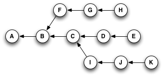
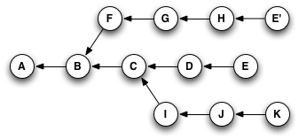
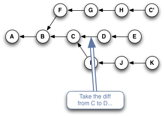
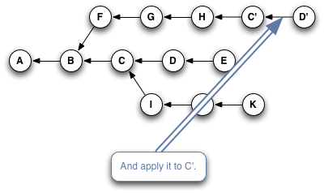
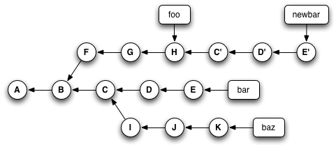

# Rebase From the Ground Up
Rebase is the single most useful command I use in Git. More importantly, it's actually pretty easy to understand once you get the hang of it.

There something very important about rebase: **it is generally considered rude to rewrite history in public**! Before you start using rebase in a shared repository, make sure **everyone** who works on your project is comfortable working with rebase. You might also consider changing everyone's default pull strategy to "rebase" instead of "merge".

I'm going to take a brief digression, because I think it's much easier to explain rebase in the context of another Git command: `git cherry-pick`.

# Cherry-Picking Explained

Git's own online help has a perfectly accurate, if characteristically terse, description of what the command does:

> Given one or more existing commits, apply the change each one introduces, recording a new commit for each.

I've already mentioned (back on the page about [Garbage Collection](graphs_and_git.md#garbage-collection)) that a Git commit's ID is a hash of both its contents and its history. So, even if you have two commits that introduce the exact same change, if they point to different parent commits, they'll have different IDs.

What `git cherry-pick` does, basically, is take a commit from somewhere else, and "play it back" wherever you are right now. Because this introduces the same change with a different parent, Git builds a new commit with a different ID.

Let's go back to this example from the [Reachability](graph_theory.md#reachability) section:



If you were at node H in this graph, and you typed `git cherry-pick E` (_yes, you'd actually type part or all of the SHA for the commit, but for simplicity's sake, I'll just use the labels that are already here_), you'd wind up with a copy of commit E—let's call it "E prime" or **E'**—that pointed to **H** as its parent, like so:



Or, if you typed something like `git cherry-pick C D E`, you'd wind up with this when you were done:


The important thing to notice here is that Git has copied changes made in one place, and replayed them somewhere else. Here are seven images that explain in detail:

1. 
2. 
3. 
4. 
5. 
6. 
7. 

# Using `git cherry-pick` to Simulate `git rebase`

Once you have git cherry-pick down, you can start off by thinking of git rebase as being a faster way to cherry-pick all of the commits in a given branch at once, rather than having to type out their IDs separately.

(That's only the very beginning of what rebase can do.)

Let's go back to our trusty example, but this time add some branches...


Now, I could type this sequence of commands:
```
git checkout foo
git checkout -b newbar
git cherry-pick C D E
```

In order, these commands: 
* Make sure we're at **H** (_because 'foo' points to it_),
* Create **and check out** a temporary branch called "newbar", also pointing at **H**,
* Apply the changes from **C**, **D**, and **E**, creating new commits **C'**, **D'**, and **E'**, and update the "newbar" branch so it points at **E'**.

Which would give me a repository that looked like this:



Then, I could type this:
```
git checkout bar
git reset --hard newbar
git branch -d newbar
```
Which would:

* Switch to the branch called "bar",
* Forcibly move the "bar" branch pointer so that it pointed to the same place as the "newbar" branch (and, thanks to the `--hard` flag, update my working directory to match the new location), and
* Delete the temporary "newbar" branch.

And leave my repository looking like this (_note that the original **D** and **E** nodes are no longer reachable, because no branch points to them_):


***Or,*** I could have accomplished all that by typing this instead:

`git rebase foo bar`

In other words, `git rebase` (in this form) is a shortcut that lets you pick up entire sections of a repository and move them somewhere else.

# A Helpful Mnemonic for `git rebase` Arguments

To summarize the previous section, this:
```
git checkout foo
git checkout -b newbar
git cherry-pick C D E
git checkout bar
git reset --hard newbar
git branch -d newbar

```
 is equivalent to this
`git rebase foo bar` 

When you do a rebase, you are ***rewriting history***. You are, in effect, saying to Git, "Hey, you know those things that happened over there on that completely different timeline? I want you to pretend that they happened here instead."

The documentation for the rebase command lists a lot of different ways you can invoke it. Frankly, I'm still not sure what some of them do, and I have a hard time parsing out the different parentheses and brackets to figure out exactly how you'd use, for example, `--onto`.

Here's how I think of it: in English, we read **from left to right**. On most charts that show the change in something over time, time is shown on the x-axis of the graph, with time increasing **from left to right**. When you issue commands to the shell, you can put several of them on one line, and they'll be executed in order **from left to right**.

So when I use `git rebase`, I (almost) always give it two arguments: the name of the place I want to start from, and the name of the place I want to end up. Or, to put it another way, I tell rebase the sequence of events I want it to create, **from left to right**: `git rebase first_this then_this`

