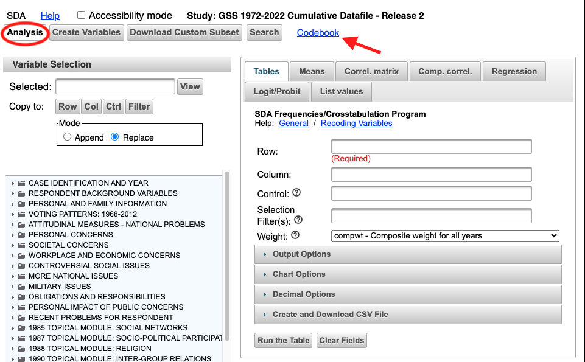
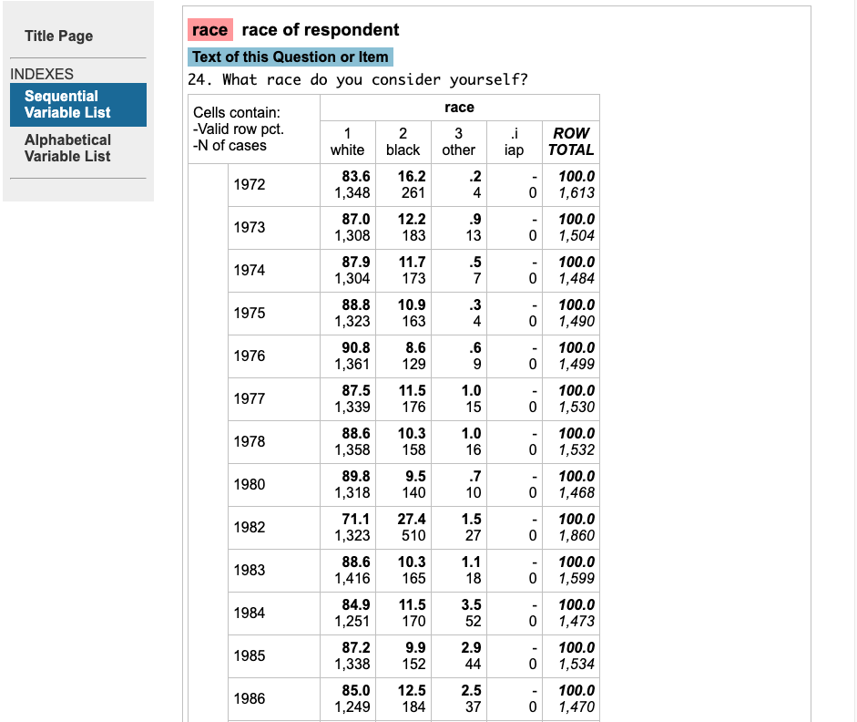
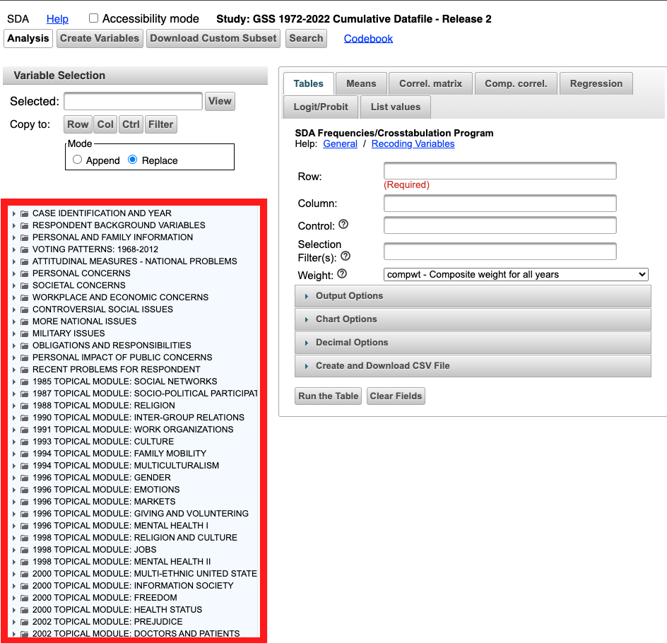
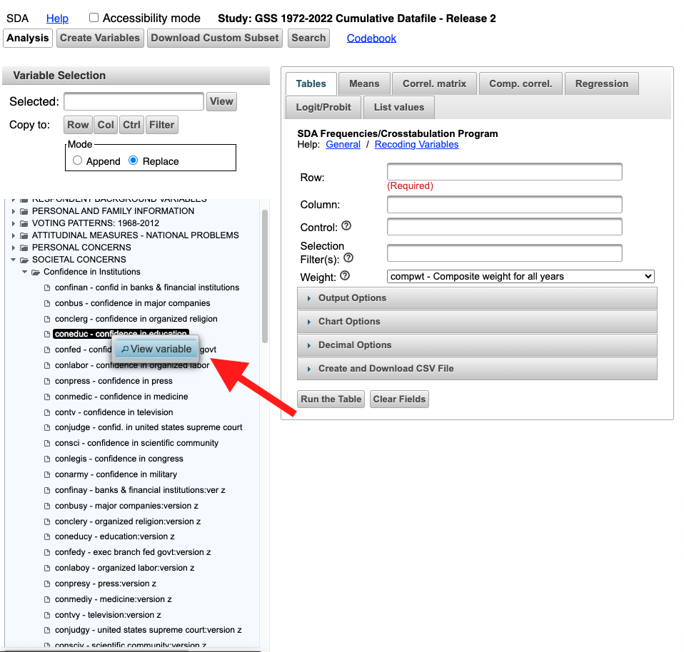
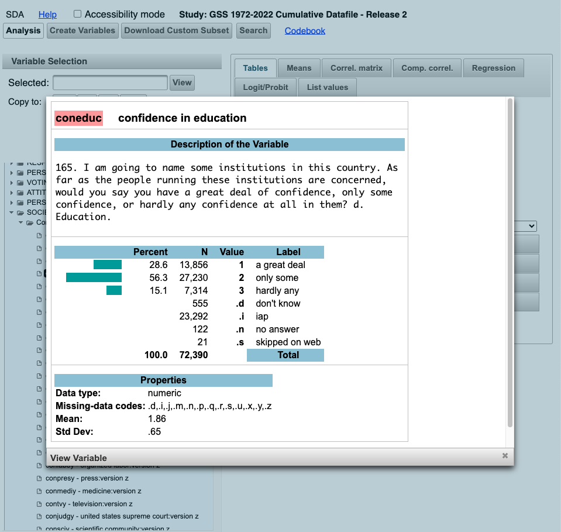
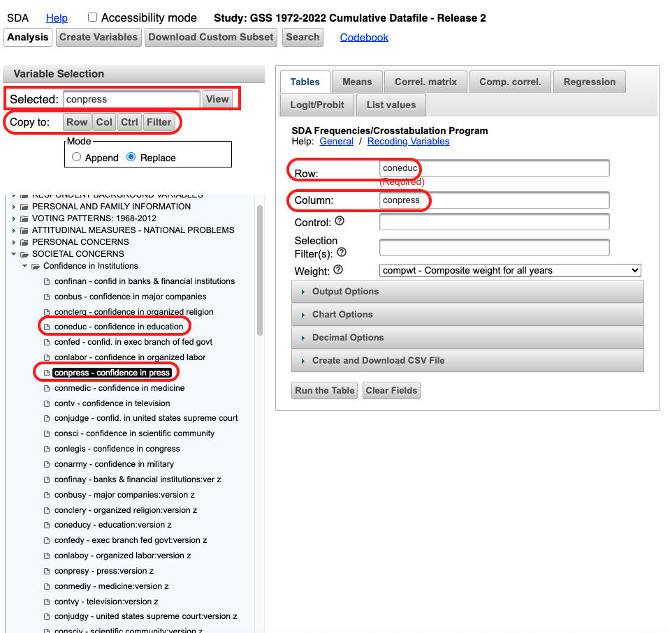
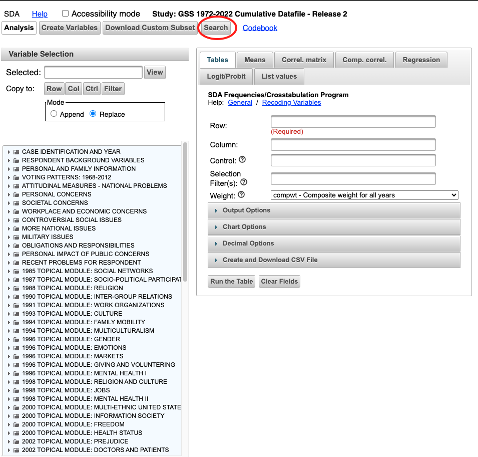
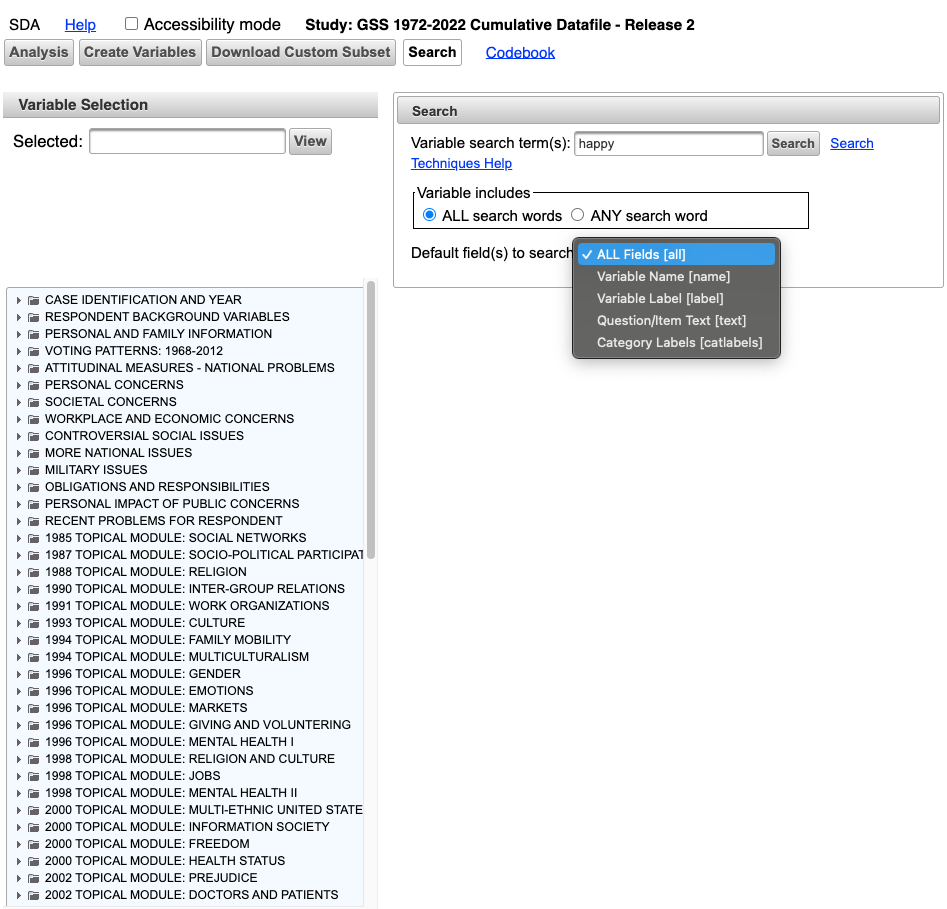
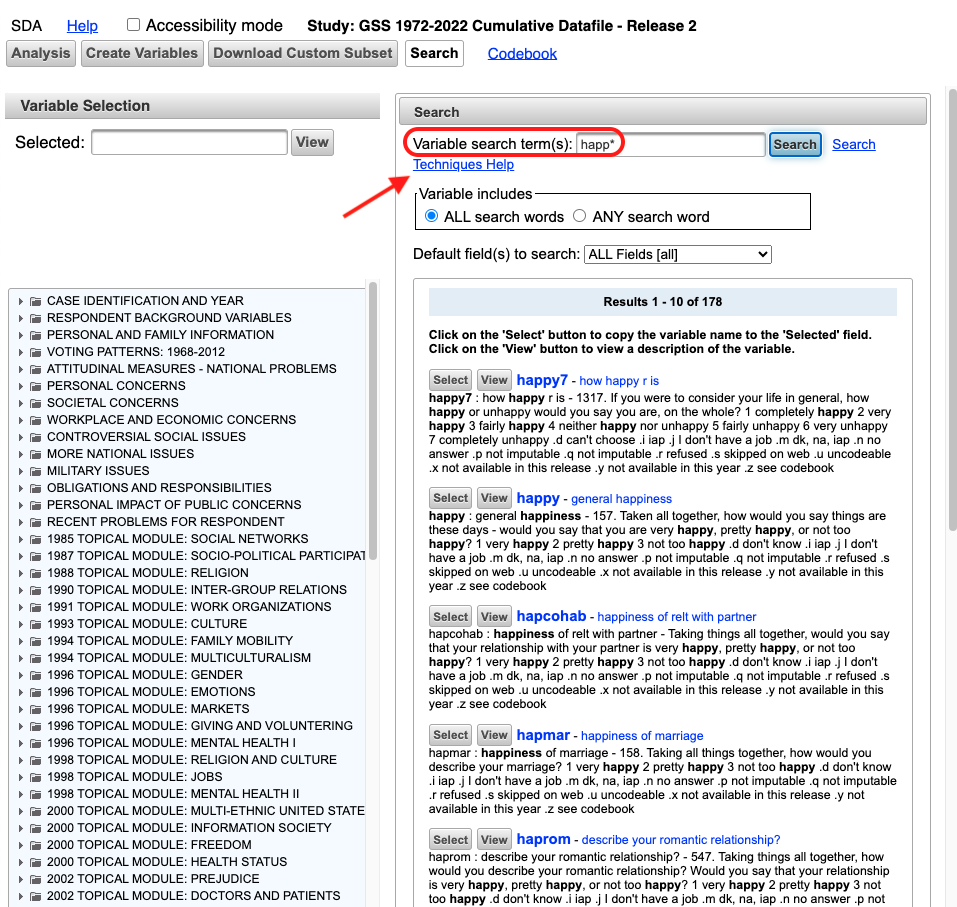

# Finding Variables

[Intro to the User Interface and Basic Tables](https://www.youtube.com/watch?v=rBC3wT5GE_c) from the [SDA YouTube Channel](https://www.youtube.com/@SDAtutorials/videos)

The first thing one needs to do for an analysis with microdata on the [SDA site](https://sda.berkeley.edu/archive.htm) is to find variables in the survey. This can typically be done by clicking the `Codebook` link on the survey's `Analysis` page.

This will bring you to a page that will typically have both a _Sequential Variable List_ and a _Alphabetical Variable List_ as well as a short introduction and weights explainer page. You can get to an individuals variable's page that typically has its categories, years of availability and frequency distribution:

The structure in the SDA variable tree (pictured below) is idential to that of the codebook and is another way to find variables.

One can drill down to individual variables from the variable tree and right-click on them to bring up the `View variable` for another detailed look at an individual variable.

To input variables into `Tables`/`Means`/`Correl. Matrix` and other analysis tools, one of three methods are possible:

1. Type the variable **code** – not name – exactly as it is found in the codebook/variable tree into the desired location.
2. Left-click drag and drop the variable from the variable selection tree into the desired location.
3. Left-click the variable and wait for it to population into the `Variable Selection` area, then select a `Copy to:` button to the desired location.

Another way to look for variable is to use the `Search` functionality.

One can search for a keyword(s) in all fields, or in the variable name, variable label, question/item text, or category labels, specifically.

Wildcards can also be used for search queries. More documentation on specific varaible search query techniques can be found at the `Techniques Help` link on the `Search` page.

