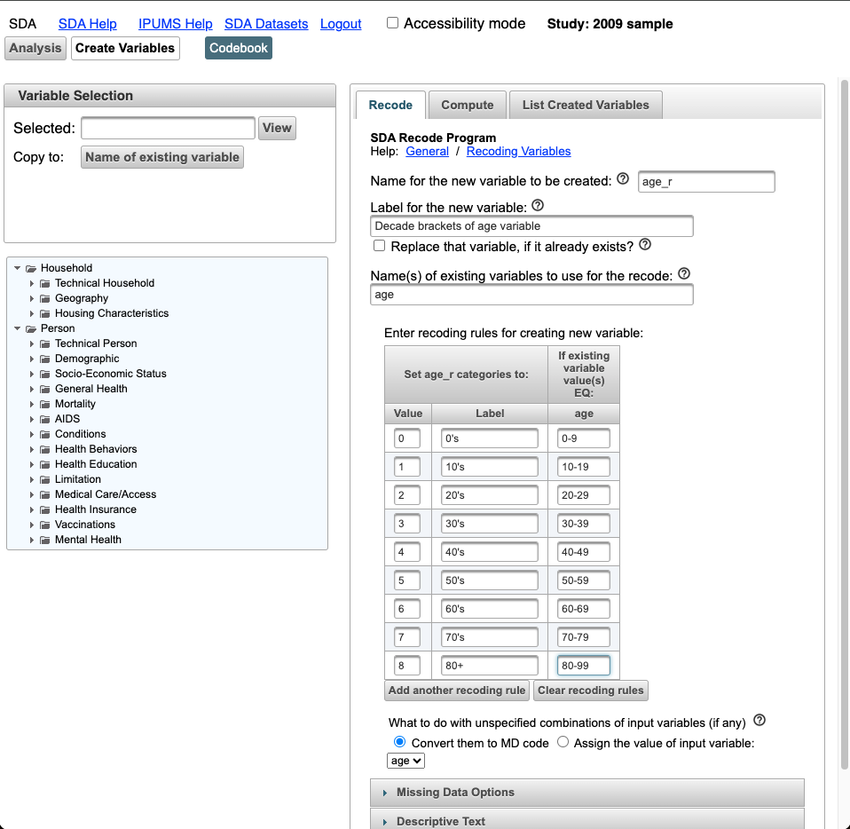
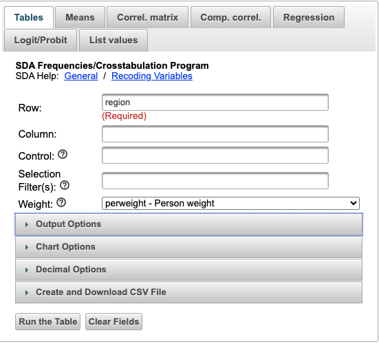
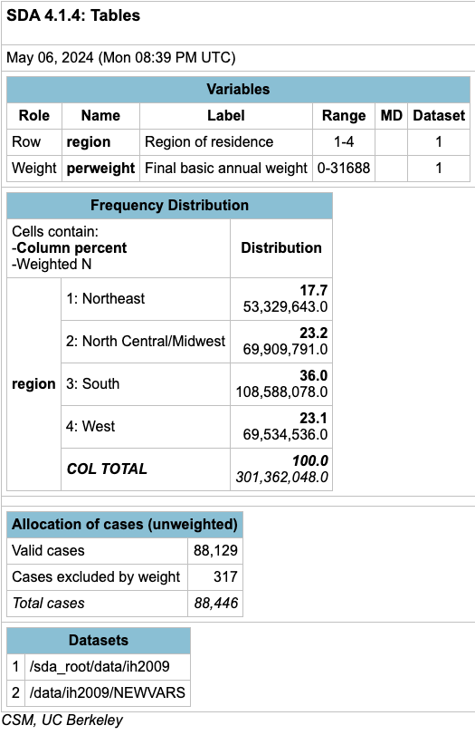
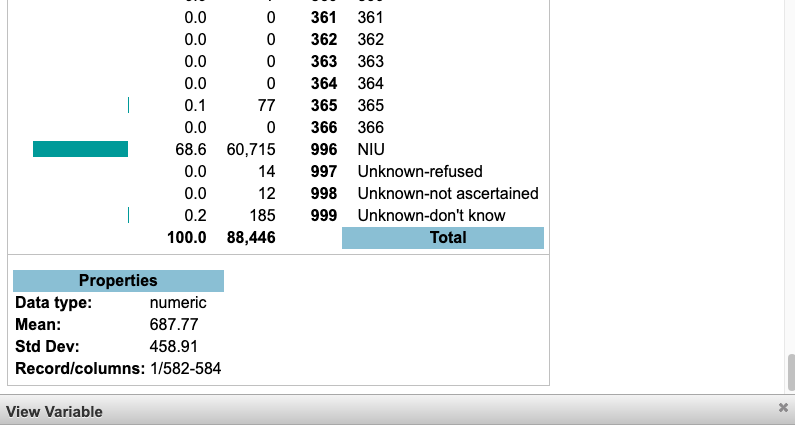

# [Using the Online SDA Tabulator with NHIS](https://nhis.ipums.org/nhis/resources/userNotes_sda_instructions.pdf)

Before you begin to use the Survey Data Analyzer (SDA), an online data tabulator, we recommend that
you open a separate browser and pull up the [variables page](https://nhis.ipums.org/nhis-action/variables/group) on the National Health Interview Survey
(NHIS) [website](https://nhis.ipums.org/nhis/) to access the appropriate documentation for each variable of interest. ***Variable lists for any given survey year can also be found by clicking the `Codebook` button at the top of the SDA web tool.*** Most years of the survey have at least several hundred variables, and the website has tools to help you
locate the variables you want. Variable descriptions on the website report codes and frequencies
(useful when recoding data), specify the appropriate weight in each year, and discuss changes that limit
comparability of the variable over time. For example, the variable HEALTH, which we will use below, has
gone from a 4-point scale to a 5-point scale over time. Changes like this are described in detail in the
variable descriptions on the NHIS website. 

There are two main tasks for which SDA is useful: 
1) Calculating frequencies and cross-tabulations 
2) Comparing means 

These tasks are discussed, in turn, below. Researchers who wish to use NHIS data for
more advanced analyses (e.g., regressions) should download a data extract from the NHIS website and
conduct their analysis with a statistical package such as R, SAS, SPSS, or Stata, rather than with SDA. 

## Frequencies/Cross-tabulation Program

First select the year(s) in which you are interested from the [SDA-NHIS interface](https://nhis.ipums.org/nhis/sda.shtml) Let's use the 2009 sample.

Next, choose the variables you would like to analyze. To generate frequencies or cross-tabulations, you
can either type the variable names into the Row and Column boxes pictured below... 

...or use the variable dictionary on the left side of the screen. (Given the number of variables in most
years of IHIS, this second option is probably more time consuming and less helpful.) 

The variable dictionary is generated based on the sample(s) you have selected. The variables available
in each sample are organized into thematic groups by record type (household, person). To select a
variable to analyze using the dictionary, click on the variable name. 

After you click on the variable name, the "selected box" above will be populated with the variable you
have chosen. Now use the "Copy to" buttons below your variable name to enter your variable into the
field of your choice. (If you entered the variable names directly, after finding the variables you want to
use on the IHIS website, you will go directly to the step directly below this text.) Select the `age` variable in the `Person -> Demographic` folders.

The two most important fields in the frequencies/cross-tabulation program are "Row" and "Column."
With variables entered into these fields, the system will produce a basic cross tabulation, or table. By
default, the SDA will calculate column percentages so that the values in each column sum to 100.

We will walk through a brief example of some considerations that should be made to obtain a table that
presents data in a meaningful way. First we will show you some points to consider in selecting the row,
column, and other characteristics. Let's say you want a table that presents the relationship between age
and health status. To create this table, enter "age" as the row variable and "health" (`Person -> General Health`) as the column variable. The input is pictured below. 

To obtain output, click "Run the Table." The beginning of the output looks like this: 

The resulting table is potentially problematic for four reasons. First, the table is large and therefore
does not provide an overall sense of the relationship (if any) between age and health status. This is
because the age variable has 86 valid values, resulting in 86 different rows in the table. The partial
output above pictures only the first 12 rows of the age variable. 

Second, the column percentages (rather than the row percentages) sum to 100. Whether you want
percents for rows or columns depends on your research question. In our example, the column
percentages largely reflect the size of the age category, rather than the relationship between age and
health. It would be much more useful if the row percentages (showing the distribution of health status
within each age group) were present and summed to 100.

Third, the table includes data from individuals whose health status was coded as "unknown--refused"
and "unknown--don't know." You will probably want to exclude these "unknown" cases, to get
meaningful row percentages of health status by age that sum to 100 percent.

Fourth, the table is unweighted. The National Health Interview Survey (NHIS) has a complex sample
design that oversamples some demographic groups in some years, so weighted results should be used.

The solution to the first problem (of too many values) is to use an SDA function known as recoding. To
recode a variable, hold your cursor over the "Create Variables" option at the top of the SDA web page. Then make sure the "Recode" tab is selected. The rest of the screen should look like this:

Our goal is to simplify our original output by collapsing the values of the age variable into more
manageable categories. One strategy might be to group the responses by decade (i.e., 0-9, 10-19, etc.).
To do this, we first need to name the new, recoded variable that we are creating. You may choose any
name you want, as long as it is not a name already taken by another variable. Let's call our new age
variable "age_r," with the "r" indicating that the variable is a recode.

The second step in recoding is to identify the already existing variable(s) that will be used as the
source(s) from which we create our new, grouped age variable. In this example, the existing variable is
"age." You can type "age" into the "Name(s) of existing variables to use for the recode:" box, or you can select age from the variable list to the left and click the "Copy to: Name of existing variable" button.

The top portion of the right-hand side of the screen should now look like this: 

Just below this, we need to enter values and labels for the output variable (age_r) and the values of the
input variable (age) that will be used to define the values of the output variable. At this point, it is a
good idea to look at the codes and frequencies for the variable you are recoding, by checking these
through the variable description on the IHIS website in a separate browser window. 

If we go to the variable description for the IHIS variable "age" and click on "codes," this brings up a table
of codes for each year (marked by X's if the code is present in the specific year, or by unweighted
numeric values if you select "case-count view"). Through the codes and frequencies page, we learn that
the variable "age" is topcoded at age 85+ for some survey years, and that the number of cases in each
single year age category becomes quite small at the highest ages. We might, then, decide to make the
final age category be age 80 or older. 

To return to the SDA interface, if we wanted people age 0-9 to be put into one category with the value
"0" and the label "0's," and we repeated this pattern for each age grouping, the screen should look like
this. Note that you can we click on "Add another recoding rule" to continue our recoding:

We have now assigned output values for all of the valid values of the input variable "age." If you want,
you may assign a label to the new variable age_r, although this is not necessary. Now, click on the "Start
Recoding" button, located just below the "Descriptive Text" menu. 

SDA will then create our new variable "age_r" by recoding values of the input variable "age." As you can
see from the output, a variable that had 86 values has been used to create a variable that has only 9
values.

We can now use the new variable "age_r" in any analysis, just as we would use any other variable. To
return to the Frequencies/Crosstabulation menu, hold your cursor over the "Analysis" option at the top
of the screen and navigate to the "Tables" tab. 

You can now repeat the same steps as before to create a table of age and health status. However, this
time you will use "age_r" as the row variable (instead of "age"). The column variable will still be
"health." However, at this stage, we can also take care of the "unknown--refused" and "unknown --
don't know" categories from the health status variable. As you saw in the original table of age and
health status, the valid values of health status are 1-5, and 7 and 9 are the values of the "unknown"
groups we do not want to include. We can limit cases by typing "health(1-5)" as our column variable.
This means we only want the table calculated for those having a health status value of 1-5. 

To generate more meaningful percentage figures, we can check the "Row" box under Table Options for
Percentaging. This allows us to see the distribution of health status within age categories.
(Alternatively, we could make "age_r" the column variable, and make "health(1-5)" the row variable. In
that case, column percentages, which are already set as the default percentaging option, would be more
helpful.) 

Neither row nor column percentages are intrinsically better than the other. The default SDA setting
produces column percentages, but you should choose between row and column depending on which is
appropriate for your research question. 

Finally, as explained above, we need to run weighted data. The variable descriptions available on the
NHIS website tell us which weights to use with each variable. That documentation tells us that for the
NHIS variables HEALTH and AGE (which is the source variable for our SDA variable "age_r") we need to
use PERWEIGHT. We can select perweight from the Weight drop-menu. Thus, the input incorporating
all these changes should look like this: 

Note: If all you want to do is look at the distribution of cases within the sample, it is not necessary to
run the table using weights. However, if you want to make any inferences about the population from
which this sample is drawn, weights are necessary.

By clicking "Run the Table," we get new output: 

This is a much more manageable table, and it includes only respondents whose health status was known and reported.

Each cell of the table contains 3 numbers. If you look at the upper-left corner of the above graphic, you will find a key that explains what each of these numbers means. Users should bear in mind that the NHIS represents the US civillian, non-institutionalized population (hereafter, "the population" for brevity) in a given year. 

If you look, for example, at the cell at the intersection of "30's" and "Excellent," you see that 13.0 is the
column percent. This means that 13% of the population with excellent health are in their 30's. The
second number is 35.6, which is the row percent. This indicates that 35.6% of the population in their
30's are in excellent health. This is a more meaningful number than the column percent. You might contrast it with, say, the row percent in the 80+ Excellent health cell. The results there indicate that only 9.5% of people at least 80 are in excellent health. Finally, back in the cell at the intersection of "30's" and "Excellent" you see a "weighted N" of just over 14 million. This indicates that there were about 14 million people in the population in 2009 who were in their 30's and had excellent health. 

Now let's imagine that you want to know whether the relationship between age and health status varies
according to some third variable. Perhaps the relationship is different for males than it is for females.
You can take a third variable into account by using the "Control" field, to produce a separate table for
each category of the variable you enter there. If you wanted to see the relationship between age and
health status for males and females separately, you would enter the variable "sex" as the control variable.

Clicking on "Run the Table" yields this output: 

Entering "sex" as a control variable allows a quick visual comparison of whether the relationship
between age and health status is different for males than for females. For both groups the tables
indicate a negative relationship between age and health. That is, older people tend to have worse
health status than younger people.

Users will notice that the default output includes color coding, which is representative of Z-statistics.

To see explanations of the meaning of Z-statistics and the color coding, click on the question marks next to "Color coding" and "Z-statistics" checkboxes in the interface of Output Options. 

You can also opt to turn the color coding off by unchecking the "color coding" box shown above.

Another SDA option, "selection filter(s)," allows you to analyze only a specific subset of respondents for
a given variable. This option works best when using the NHIS data file for 1997 forward, when you want
to select only certain years (e.g., 2002 and 2007) to use in your analysis. 

When used with other, non-year variables, however, the selection filter is only useful for getting a sense
of data distribution. The selection filter is not useful for variance estimation or significance testing,
because of the complex sample design of the NHIS.

To continue the example begun above, let's say we wanted to check the relationship between age and
health by sex, but only for people who have never been married. In other words, is the relationship
between health and age different for never married females than for never married males? To do this,
enter the variable "marstat" (legal marital status) as a selection filter, followed by the code for "never
married" in parentheses. 

To find out the code for "never married," you can review the codes and frequencies by clicking on
"codes" in the MARSTAT variable description on the IHIS website. Alternatively, you can enter "marstat"
in the Variable Selection box to the left side of the screen and click "View." Doing so will open another
window: 

As you can see, the code for "Never married" is 50. Thus, your input to produce tables for only nevermarried people will look like this: 

Clicking "Run the Table" produces separate tables for males and females again, since we have kept "sex"
as a control variable.

This time, however, only respondents who have never been married have been included. As you see,
the number of cases drops off dramatically, beginning with people in their 30's compared to those in
their 20's.

Note: While use of a selection filter to produce a table for a subset population may give you a general
sense of the relationship between variables, users should be cautious about drawing statistical
inferences from such results. Due to the complex sample design of the National Health Interview
Survey, restricting analysis to a subpopulation as described above may yield incorrectly computed
standard errors. See the IHIS user note on Variance Estimation for further discussion of this problem and
for examples of correct practice in subpopulation analysis using a statistical package like R, SAS, Stata, or
SAS-callable SUDAAN. 

## Analyzing Multiple Years of Data

You will notice on the SDA-NHIS interface that you have the choice of either using data from a single year or using data from multiple years for 1997 forward. The time period of 1997 forward was chosen
because a redesign of the NHIS in 1997 resulted in more variable consistency for 1997 forward than for
earlier years. If you want to analyze data from multiple years prior to 1997, you will need to analyze
each year separately. 

You will need to use either the [1997-2019 multi-year SDA dataset](https://sda.nhis.ipums.org/sdaweb/analysis/?dataset=nhis_1997_2018) or the [2019 to present multi-year SDA dataset](http://sda.nhis.ipums.org/sdaweb/analysis/?dataset=nhis_2019_present) to do multi-year analysis. In 2019, the NHIS questionnaire [was redesigned](https://nhis.ipums.org/nhis/userNotes_2019_NHIS_Redesign.shtml) to increase relevance, enhance data quality, and minimize respondent burden.

You may use the 1997 forward data file to analyze pooled data from multiple years. Alternatively, you
may use the "Control" function to produce separate output for multiple years at once. The procedure
for doing this is similar to the example above where we used "sex" as a control variable to produce
separate tables for males and females. To produce separate output for each year when using the 1997
forward data file, enter the variable "year" as the control variable.

The above input produces the requested table for each year that both variables are available from 1997
forward, as well as a final table using pooled data from all available years for 1997 forward.

This is the table for 1997: 

And this is the table for all years 1997-2018:

Note: Use `year(1997-2009)` to only select a specfic range of years in the `Control:` function.

## A Word of Caution Regarding the Use of Household Variables

Researchers wishing to do an analysis using household variables should exercise caution. If the desired
unit of analysis is the household, such an analysis should not be done using SDA. The data that SDA
employs in its analyses are rectangularized, meaning that household records have been attached to
each person record. The result of this data structure is that the frequencies reported by SDA for
household variables, such as "region," actually reflect the number of **persons**, rather than the number of
**households**.

If, however, the desired unit of analysis is persons (even when analyzing "household" variables), it is
appropriate to use SDA. If you want to know the number of people living in each Census region of the
United States, you can apply the **person** weight variable in the Frequencies/Crosstabulation Program to
obtain frequencies for "region." 

Researchers who want to obtain the number of households in each region (or use any household
variable with households as the unit of analysis) should use the NHIS website to download a **hierarchical**
data extract (rather than a rectangular one). To produce figures on the number of households with a
given characteristic, they should then analyze household records (those with a value of "H" in the
variable RECTYPE) with a statistical package such as R, SAS, SPSS, or Stata, rather than SDA. 

## Comparison of Means Program

Rather than making a table, you may wish to compute the mean value for a variable. To compute and
compare means, use the comparison of means program in SDA. This program calculates the mean of a
designated "dependent variable" within categories of a "row variable."

To begin, as with the frequencies/crosstabulation program, select the year(s) in which you are
interested. Let's use the 2009 sample again. 

Next, select the "Means" Tabe in the analysis window.

Enter the variable for which you want to calculate the mean (average) as the "Dependent" variable.
***Only enter a numerical variable here***, as those are the kind of variables for which an average can
logically be calculated. If you enter a non-numerical variable (e.g., "sex"), SDA will still calculate a
"mean" based on the values and frequencies of that variable, but any such "mean" will have no real
meaning.

With that in mind, let's enter "bedayr," which is the number of days during the preceding 12 months
that illness or injury kept a person in bed for more than half the day. By consulting either the variable
description on the NHIS website, or by entering "bedayr" in the SDA variable dictionary and clicking
"View," we can see that the values for "bedayr" range from 0 (none) to 999 (Unknown-don't know).
However, only 1-366 actually correspond to days in bed. 

If you look at code 996, you see the label "NIU." NIU is the NHIS abbreviation for "not in universe";
persons with this value for a variable were not asked the survey question relating to that variable. We
would normally want to exclude anyone coded as NIU from analysis, by following the procedure
described above for including only the valid values of the health status variable (i.e., for excluding cases
coded as "unknown" health status). For "bedayr" we want to exclude both the NIU responses and the 3
varieties of "Unknown" responses when calculating a mean value.

Thus, we enter "bedayr" as the "Dependent" variable, with the numbers 0-366 following in parentheses.
This restricts the input to persons with a reported number of bed days ranging from 0 to 366. If we
wanted to calculate the average number of annual bed days within each category of health status, we
would enter "health" as the row variable. As in the frequencies/cross-tabulation examples, we will put
(1-5) after the health variable, to include only valid responses and exclude "unknown" responses. 

Earlier we learned that the "health" variable should be used in conjunction with the "perweight" weight
variable, according to the NHIS website. Checking the variable description for "bedayr" on the NHIS
website tells us that that "bedayr" should be used with the "sampweight" weight variable. In such
cases, where two different weights are specified for two variables you wish to combine, it is appropriate
to use the "narrower" of the two weight options. Everyone in the NHIS sample has a person weight, but
only sample persons have a sample weight. In this case, then, we should use "sampweight" as our
weight variable. (Similarly, if the choice is between "perweight" and "mortwt", you should use
"mortwt." If the choice is between "sampweight" and "mortwtsa," you should use "mortwtsa." See the
[NHIS user note on weights](https://nhis.ipums.org/nhis/userNotes_weights.shtml) for more information.) 

The input to get means for "bedayr" sorted by health status looks like this: 

By clicking "Run the Table" you get this output:

As with the earlier example, the box in the upper-left corner explains the numbers in each cell. The bold
number is the mean – the average number of bed disability days for people with a given health status. In
2009, people with excellent health had, on average, 1.09 bed disability days in the 12 months prior to
being surveyed. By contrast, those with poor health had 56.13 bed disability days, on average, over the
same time period. The second number in each cell is the standard error. Because NHIS uses a complex
sample design, these standard errors are calculated in SDA using the Taylor series method. Standard
errors are used in significance testing (see below). For more information, click on the "Complex std errs"
link under Table Options.

The third number in each cell is the weighted number of cases used to calculate the mean. There are
fewer total people in the population of this analysis (about 226 million) than in the cross-tabulation done above (about 301 million) because the survey question for "bedayr" is only asked of sample adults,
rather than all persons in the NHIS sample. 

## Significance Testing

The procedure just covered will display the means for any numeric variable. Some SDA users may wish
to extend their analysis further by testing whether differences between means are statistically
significant. The NHIS data are based on a sample of people included in the National Health Interview
Survey. Because only a small subset of the U.S. non-institutionalized population was included in NHIS,
results based on survey responses will differ somewhat from what the results would have been if
everyone in the United States had answered these questions. Significance testing provides a means of
evaluating how confident we are that differences (e.g., in means) observed with survey respondents
would also be observed in the general population. 

After incorporating all the information noted above, our input to calculate the mean of bedayr within
health status categories looks like this: 

Clicking on "Run the Table" yields this output:

There are now 4 numbers in each output cell (except for the "Excellent" cell, which serves as our
reference point). The bold numbers are the difference in means for "bedayr" relative to the "bedayr"
mean for those in excellent health. They report the difference in average number of days spent in bed
due to illness or injury in the past year by people with the specified health status. For example, people
in good health had an average of 3 more bed disability days than those in excellent health during the 12
months prior to taking the survey. People with poor health had an average of 55 more days of bed
disability than those in excellent health.

The second and third numbers are again the standard error and weighted N, respectively. 

The final number in each cell is the T-statistic. This figure indicates whether a difference in means is
"statistically significant." Statistical significance in this case refers to the probability that a difference of
means observed in the sample would be observed in the population. Generally, a T-statistic of at least
+1.96 (or less than -1.96) indicates statistical significance (i.e., highly probable that the means are
different in the population). The T-statistic is greater than +1.96 for every category of health, meaning
that in the population, it is likely the mean number of bed disability days is higher for people in each
health category 2-5 (very good-poor) relative to the people in health category 1 (excellent). 

As with the frequencies and cross-tabulation program, we can also use recoded variables and apply
control variables or selection filters in conjunction with calculating means. As an example, let's re-run
this comparison of means using our recoded age variable as the "Row" variable. This time let's set our
base category to 4 (people in their 40's). 

By clicking "Run the Table", we get this output:

Now the difference in average number of bed disability days is reported relative to people in their 40's.
Here we see that people in the oldest age group have 3.8 more bed disability days per year, on average,
than people in their 40's. The T-statistic of 2.28 indicates that this difference is statistically significant
(i.e., probably would be observed in the population, not just the sample). By contrast, those in their 20's
have, on average, 2.3 fewer bed disability days per year than those in their 40's. The T-statistic of -2.98
indicates that this difference in means (between 20's and 40's) is also statistically significant. Notice that
the T-statistics for people in their 60's and 70's are not large enough to indicate statistical significance.
This means that, in the population, it is not very probable that the mean bed disability days for those
age groups are different from the mean bed disability days of people in their 40's. 

