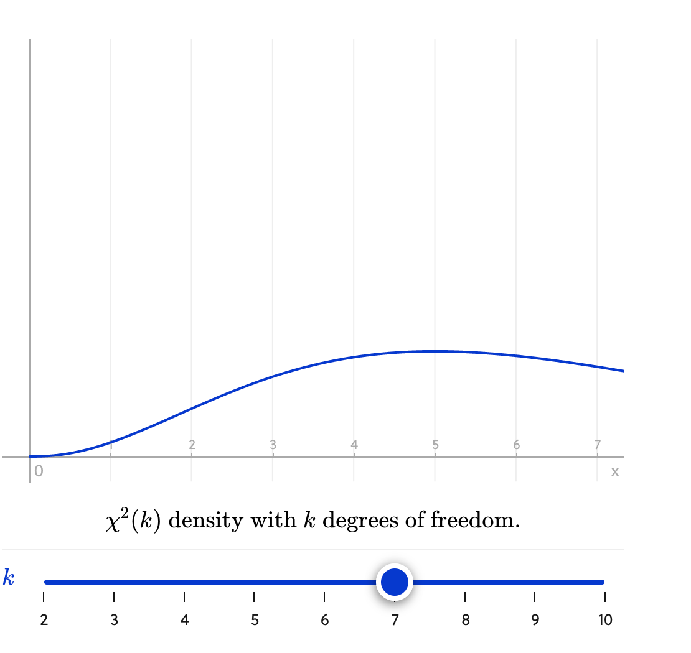

In a string of $n$ events, say for example shooting basketball free throws, there are $\binom{n}{m}$ ways of having $m$ misses. $m$ here is the $k$ variable that is used in the generalized formula.

Here the **choose** symbol $\binom{}{}$ counts the different arrangements of misses:
$\binom{n}{m} = \frac{n!}{m! * (n - m)!}$ 

For example, if a basketball player has a historical free-throw miss rate of $p$, the **product rule** $P(A\:\cup\:B) = P(A) * P(B)$, says that the probability they miss $m$ shots out of $n$ tries is:

$P(m) = \binom{n}{m}(p)^m * (1 - p)^{n-m}$

**if** their skills remain unchained from the historical miss rate.

This is the **binomial random variable**: the number of successes $k$ out of $n$ _independent_ trials of that experiment. The **binomial distribution** of that variable is:

$\binom{n}{k}p_i^m(1 - p_i)^{n-m}$

where $p_i$ is the probability player $i$ will miss a shot.

The sum of squares of $k$ independent standard normal variables is called a $\chi^2(k)$ **random variable**. A $\chi^2(k)$ **variable** is the sum of squares of $k$ independent standard normal variables, were $k$ is called the number of **degrees of freedom**.

Generally, there are two key design principles to abide by when making a statistic for hypothesis testing — it needs to measure extremeness, and it should have a known probability distribution.

These properties let us find a clear-cut critical region for rejecting the null hypothesis.

A **goodness-of-fit test** is used to test if sample data fits a distribution from a certain population.

While the exact form depends on the problem, it's usually a great approximation to calculate $\chi^2$ as:

$\displaystyle\sum_{i}\frac{(O_i - E_i)^2}{E_i}$,

where $O_i$ stands for an observed value and $E_i$ is its expected value should the null hypothesis $H_0$ be true. A statistic of this form is called a **Pearson's $\chi^2$ statistic**. A $\chi^2(k)$ random variable is the sum of $k$ _independent, squared normal_ variables

Using an example of a test of four basketballs players shooting free throws independently to see if their miss percentage had significantly deviated from the past, it was the sum of the squares of **four** "standardized" and independent binominal random  variables that could be approximated by the standard normal variables thanks to the _central limit theorem_.

In short, the Pearson's statistic for a test like this was an approximate $\chi^2$ random variable with 4 degrees of freedom.

The mean of a $\chi^2(k)$ is equal to $k$, the degrees of freedom. As $k$ increases, the graphs spread out and the peak of the distribution shifts to the right.

