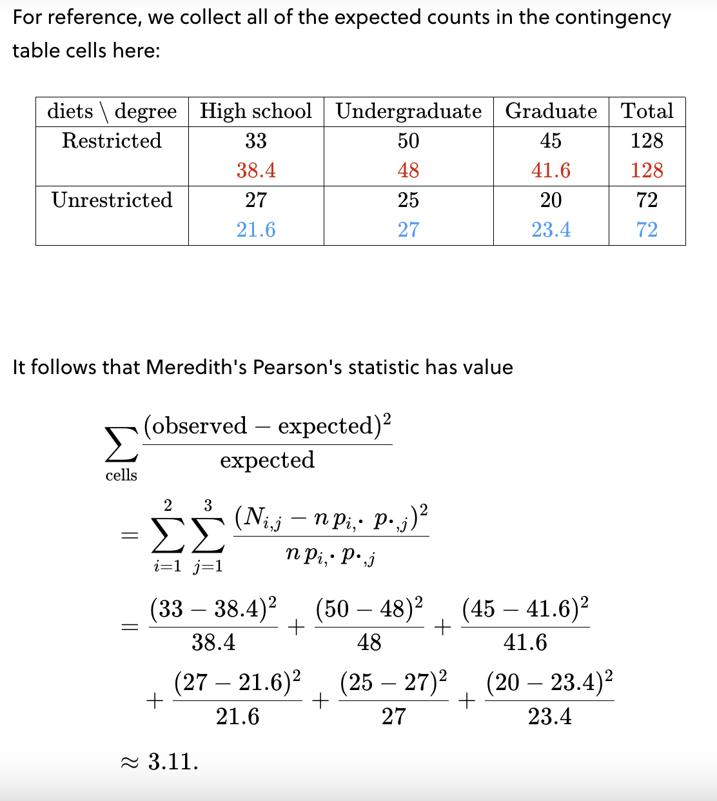

_Homogeneity tests_ test whether two populations have _same_ distribution. In an **independence** test, there's only one population, but each member has two attributes (like hair and eye color) that may or may not be related. **Independence tests** test whether two attributes in a given population are **related**.

In an independence test, it helps to arrange the distribution of one categorical variable in rows and the other in columns. The result is called a **contingency table**.

Let's say a population has two attributes, represented by categorical variables $A$ and $B$. The first takes on values $A_1, \dots, A_a$ and the second $B_1, \dots, B_b$. Then $P_{i,j} = P(A_i\:\cap\:B_j)$ is the probability a randomly selected member of the population has attribute $A_i$ and attribute $B_j$.

For example, $A$ could be "Diet" with $A_1 = Restricted\:diets$, $A_2 = Unrestricted\:diets$ and $B$ could be "Education level" with $B_1 = High\:School\:degree$, $B_2 = Undergraduate\:degree$, and $B_3 = Graduate\:degree$

Given a joint probability density function $f_{XY}(x, y)$ for $X$ and $Y$, the **marginal distributions** $f_X(x)$ and $f_Y(y)$ can be extracted from the joint probability distributions.

The $\cdot$ in the subscripts indicate that an index has been summed over. For instance, 

$p_{i,\cdot} = \displaystyle\sum_{j=1}^bp_{i,j}$ and $p_{\cdot,j} = \displaystyle\sum_{i=1}^ap_{i,j}$

The **marginal probabilities** $p_{i,\cdot}$ and $p_{\cdot,j}$ are defined by:

$P(A_i) = \displaystyle\sum_jP(A_i \cap B_j) = \displaystyle\sum_jp_{i,j} = p_{i,\cdot}$ and
$P(B_j) = \displaystyle\sum_iP(A_i \cap B_j) = \displaystyle\sum_ip_{i,j} = p_{\cdot,j}$

To test the independence of two attributes $A$ and $B$, we look for deviations from what's expectd if $A$ and $B$ are independent.

So we cook up a Pearson's statistic

$\displaystyle\sum_{cells}\frac{(\text{observed cell count} - \text{expected cell count})^2}{\text{expected cell count}}$

where the sum is over the cells in the contingency table.

The Pearson's statistic for an independence test depends on the unknown probabilities $p_{i,\cdot}$ and $p_{\cdot,j}$. To move forward, we need estimates of their values. One method is using the **principle of maximum likelihood**, which estimates unknown parameters by maximizing the probability of the observed data.

For example in the table below:

| diets\degree  | High school  | Undergraduate  | Graduate  |
|---|---|---|---|
| Restricted  | 33  | 50  | 45  |
| Unrestricted  | 27  | 25  | 20  |

$p_{1,\cdot}$​ and $p_{2,\cdot}$, are the probabilities that someone has a restricted/unrestricted diet, respectively. $p_{\cdot,1}$, $p_{\cdot,2}$, $p_{\cdot,3}$ are the probabilities that someone has a high school/undergraduate/graduate degree, respectively.

In the general case the maximum likelihood estimates are given by 

$p_{i,\cdot} = \frac{1}{n}\displaystyle\sum_{j=1}^bN_{i,j}$ and $p_{\cdot,j} = \frac{1}{n}\displaystyle\sum_{i=1}^aN_{i,j}$

where in the example above you'd need to estimate $p_{1,\cdot}$ by summing all of the participants on the restricted diet the "$1$" across educational values $33 + 50 + 45$ and then divide by $n$ the total number of people in the study $(33 + 50 + 45) * \frac{1}{200} = 0.64$. You can then subtract this value from $1$ to get $p_{2,\cdot}$. Using this math, one can find the expected value for all of the cells in the frequency table and then use those values in the Pearson's statistic as done below:

Fortunately, for very large $n$, the Pearson's statistic is approximately distributed like a $\chi^2$ random variable – its number of degrees of freedom is the last piece of the puzzle. Degrees of freedom for an independence test and an _homogeneity test_ are the same $(r - 1) * (c - 1)$ where $r$ is the number of rows in a _contingency table_ and $c$ is the number of columns. For the above example this would be $(2 - 1) * (3 - 1) = 2$ degrees of freedom.