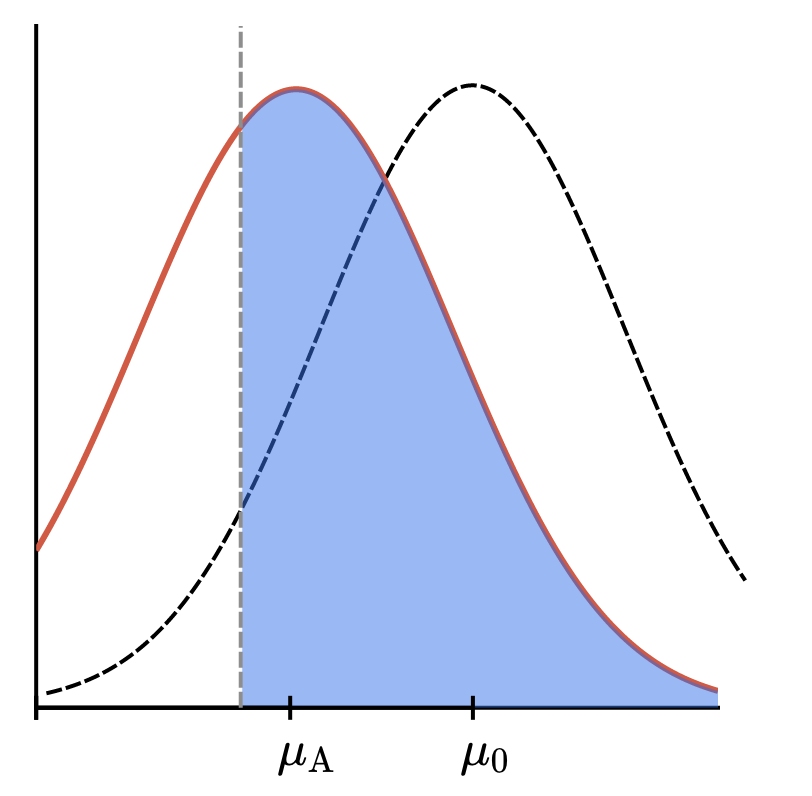

**Power** measures how good a test is at avoiding errors where sampling data doesn't represent a population and will lead you to incorrect conclusions. Because of this, it sets the standard for a hypothesis test's usefulness in detecting significant effects.

The **significance** of a hypothesis test $\alpha$ is the level of extremeness of a sample that you're willing to live with.

If we use a $Z$-test, $\alpha$ determines the _critical region_, i.e. the place where we reject $H_0$ if our statistic ends up there.

If we use a $p$-value to test our hypothesis, $H_0$ is rejected if $p \leq \alpha$.

### A false positive example
A pharmaceutical company has created a new drug, Cold-B-Gone, to shorten the length of the common cold. Before they can sell it, they need to show that it actually works. 100 volunteers infected with the cold take Cold-B-Gone each morning of their illness.

The researchers choose $\alpha = 0.05$ to **make sure** the trial detects a significant effect.

Their _null hypothesis_ $H_0$ is that "the drug has no effect" and, ideally, they don't want to reject $H_0$ if it's true. The _alternative hypothesis_ $H_A$ is that "the drug reduces the length of illness".

They use the mean length of illness as the statistic in a $Z$-test.

The probability of **incorrectly rejecting $H_0$** when it's true by definition is the significance $\alpha$.

This means that the probability of **correctly failing to reject $H_0$** when it's true is $(1 - \alpha)$ by the rule of complement.

It's highly desirably to have a hypothesis test that's very likely to fail to reject $H_0$ when it's true. Many times researchers really don't want to make a **false positive** claim that their test has some effect and reject the null hypothesis when it indeed is actually true & shouldn't have been rejected.

That's why researchers often set $\alpha$ so low – that way $(1 - \alpha)$ is high.

_However_, rejecting the null hypothesis when it's true – or **false positive** as it's often called – isn't the only possible error we can make.

A **false negative** happens when our sample doesn't give us enough evidence that the null hypothesis is wrong when in fact is **is** wrong. We'd also prefer the probability  of making this error to be small.

### A false negative example
Let's say the researchers sharpen the alternative hypothesis to:

$H_A: \mu = \mu_a,\:where\:\mu_a\text{is a fixed number less than }\mu_0$

In the graphic below, the _dashed_ bell curve represents the distribution for the mean length of illness duration if $H_0$ is true, while the _solid red_ curve is the distribution assuming $H_A$ holds. The vertical dashed line marks off the critical region for a (left) one-tailed $Z$-test of $H_0$. The probability of _failing to reject $H_0$ if it's false_, i.e. the probability of a false negative is the blue shaded area:

Let's call this probability $\beta$, just as we used the Greek letter $\alpha$ for the probability of a false positive (which is also the significance).

The area in the **other** part of the solid bell curve tels us the probability of correctly rejecting $H_0$ when it's false.

By the rule of complement, it's equal to $(1 - \beta)$.

The **power** is $(1 - \beta)$, which measures the test's ability to detect meaningful effects.

By decreasing the significance, we push the edge of the critical region farther to the left. This means the area in the part of the tail of the solid bell curve (the distribution if $H_0$ is false) in the critical region goes down.

This area is the power, $(1 - \beta)$, so _as the probability of a false positive goes down, the power goes down_.

It turns out the sample size also influences the power of a test. Assuming $H_0$ is true, the standardized sample mean given by:

$\frac{\bar{X} - \mu_0}{\frac{\sigma}{\sqrt{n}}}$

is a standard normal variable. Here, $\mu_0$ is determined by $H_0$, $\sigma$ is a known constant, and $n$ is the sample size.

This means that $\bar{X}$ is distributed as a normal variable with mean $\mu_0$ and standard deviation $\frac{\sigma}{\sqrt{n}}$ when $H_0$ holds.

Similarly, $\bar{X}$ is a normal random variable with mean $\mu_A$ and standard deviation $\frac{\sigma}{\sqrt{n}}$ assuming $H_A$ is true.

So the widths of the curves are controlled by $n$ when $\mu_0$ and $\mu_A$ are fixed.

As the _sample size_ of an experiment goes up, the experiment's **power** goes up.

Increasing the sample size means decreasing the width of the distributions, which is set by $\frac{\sigma}{\sqrt{n}}$

As the bell curves become skinnier, less and less of the $H_A$ distribution sits in the critical region, which means that the probability of making a false negative goes down. This in turn means that the power of the test increases.

### Summary
All else held fixed, the greater the difference between $H_0$ and $H_A$, the greater the power.

The converse is easier to understand – as the difference between the null and alternative hypothesis gets small, meaningful effects become harder to detect, so the power goes down.

All else held fixed, the larger the sample size, the greater the power.

A larger sample size means we're seeing more of the population, so our test will have a better chance of detecting meaningful effects.

A **false positive** (rejecting $H_0$ when it's true) is also called a **type I error**.

A **false negative** (failing to reject $H_0$ when it's false) is also called a **type II error**.

$P\{Z \leq z_0\} = \alpha$ determines rejection region for $\alpha = 0.05$. For an $\alpha = 0.05$ the $z_0$ value is -1.645.

To determine how a change in the $\alpha$ value will change the power $\beta$, first determine a criterion for rejecting the nul hypothesis $\mu = 10$. The "standardization" of the sample mean is given by 

$Z = \frac{\bar{X} - \mu}{\frac{\sigma}{\sqrt{n}}} = 2\bar{X} - 20$

So we need to solve $P{Z \leq z_0} = \alpha = 0.05$ assuming the null hypothesis in order to fix our critical region. 

Using a lookup table, one can find that $z_0 \approx -1.65$, so we reject $H_0$ if the observed sample mean is:

$\leq -1.65 = 2\bar{X} - 20$
$\leq \frac{-1.65 + 20}{2}$
$\leq 9.18$

Now we want the probability of rejecting the null hypothesis when it's in fact false – this is the power, after all.

If the mean is truly 8.5, then we define a new $Z$-statistic

$Z' = \frac{\bar{X} - \mu}{\frac{\sigma}{\sqrt{N}}} = \frac{\bar{X} - 8.5}{\frac{4}{\sqrt{64}}} = 2\bar{X} - 17$

and use it to calculate the probablity that the observed sample mean lies in the critical region.

The probability that $\bar{X} \leq 9.18$ is the same as the probability that

$Z' = 2\bar{X} - 17 \leq 2 * 9.18 - 17 = 1.36$

This new $z-0$ is associated with a power score of 0.91069

As our false positive rate $(\alpha)$ increases, our false negative rate $(\beta)$ decreases, and vice versa.

Ideally, we'd like to suppress the sizes of **both** of these rates. One option to decrease $\beta$ without changing $\alpha$ is to increase the sample size.

Generally, there are two key decisions to make when designing a study — what $\alpha$ should be, and how large the sample size should be.

If we increase the false positive rate $(\alpha)$, then we decrease the false negative rate $(\beta)$. And if $\beta$ decreases, that means an increase in power $(1 - \beta)$

Since it's ideally the case that we want to make $\alpha$ small, we can control $\beta$ through the sample size, as we just saw.

It's standard practice to make power **greater than 80%**. A study is **underpowered** if the sample size doesn't provide a power level over 80%.

To summarize, there are several questions to consider when designing an experiment:

* What effect size from our sample should be **significant**? Adjust the null and alternative hypotheses, if needed.
* Is a false positive or false negative a severe problem? Change $\alpha$ from 0.05 accordingly.
* Is the power at least 80%? If not, increase the sample size (or decrease $\alpha$ if you can).

Addressing these questions is key to designing an effective statistical study.
