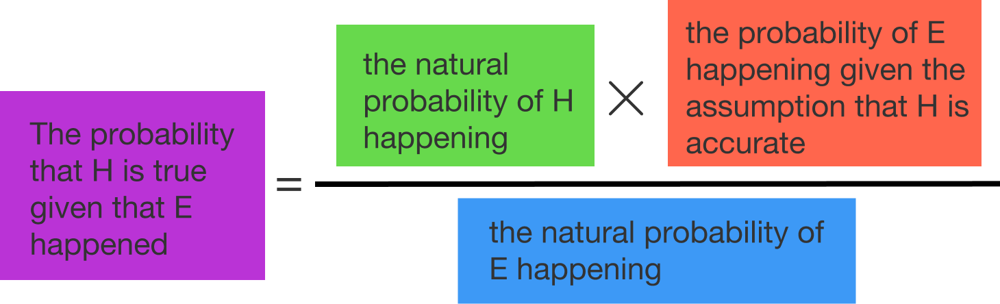

Bayes' Theorem/Rule:

$P(A|B) = P(B|A) * \frac{P(A)}{P(B)}$ or $P(A|B) = \frac{P(B|A) * P(A)}{P(B)}$

It is the definitive tool for updating probabilities in light of new evidence.

Bayes’ theorem is a formula that describes how to update the probabilities of hypotheses when given new evidence. It follows from the axioms of **conditional probability**, but it can be used to reason about a wide range of problems involving the update of information.

Given a hypothesis ($H$) and evidence ($E$), Bayes' theorem states:

$\text{The probability that H is true given that E happened} = \frac{\text{the natural probability of H happening} * \text{the probability of E happening given the assumption that H is accurate}}{\text{the natural probability of E happening}}$

