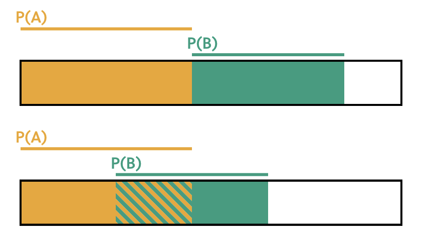

$P(A\:or\:B)$ is the probability that only $A$ happens, or only $B$ happens, or both happen. For example, in soccer a team can never score both 0 goals _and_ 1 goal in the same match. So we can just add the probabilities of each together and call the result: 

$P(Home\:Goals = 0 \: or\:Home\:Goals = 1)$

We need to be careful though, because adding probabilities is not always this simple.

When two events can't happen together, like the home team scoring both 0 goals and 1 goal, the probabilities do not overlap. When two events **can** happen together, we can show this by overlapping the probability bars.

For example, if the home team doesn't score in 24% of matches and the away team doesn't score in 33% of matches adding 24% and 33% would mean counting matches in with _both_ the home team and away team didn't score _twice_.

So if in 7% of matches both the home _and_ away team didn't score, you can get the probability that the home team scores zero goals _or_ the away team scores zero goals like this:

$P(Home\:Goals = 0 \: or\:Home\:Goals = 1) = 24\% + 33\% - 7\% = 50\%$

The more general rule:

* When two events can’t both happen, the probability of either happening $P(A\:or\:B) = P(A) + P(B)$
* When both could happen at once, we have to subtract that overlap region, so $P(A\:or\:B) = P(A) + P(B) - P(A\:and\:B)$