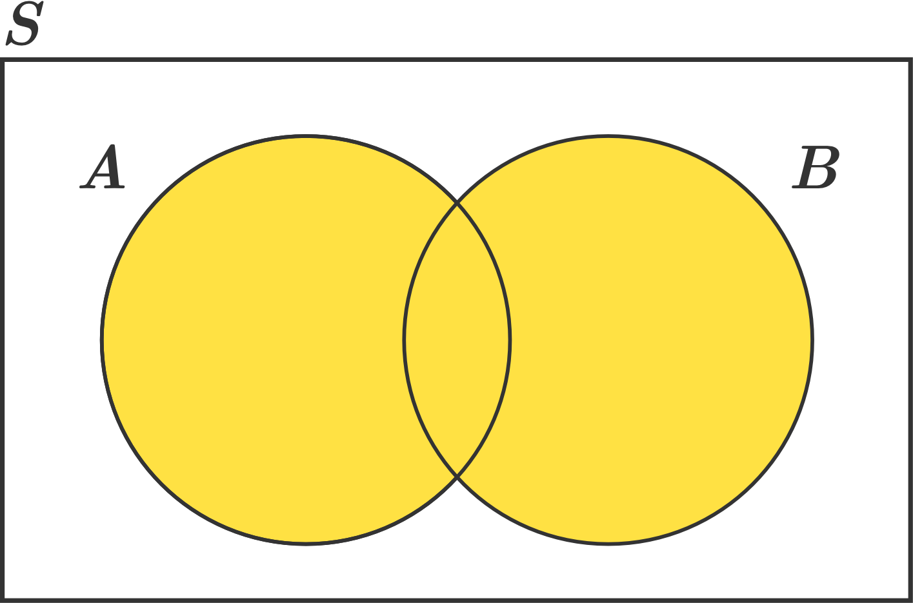
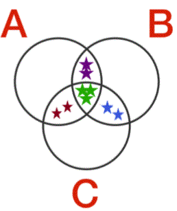

If events $A$ and $B$ are in the same sample space and are _not_ mutually exclusive.

The probability of the union of these events, via the _generalized rule of sum_ is:
$P(A\:\cup\:B) =  P(A) + P(B) - P(A\:\cap\:B)$

This generalized rule is known as the inclusion-exclusion principle.

Let $A$, $B$, and $C$ be events in the same sample space, not necessarily mutually exclusive.

The probability of the union of these events $P(A\:\cup\:B\:\cup\:C)$ is:

$P(A) + P(B) + P(C) - P(A\:\cap\:B) - P(A\:\cap\:C) - P(B\:\cap\:C) + P(A\:\cap\:B\:\cap\:C)$

You can verify that this makes sense by drawing out a Venn diagram.

If we try to include all the contents of $A$, $B$, and $C$ together:

$P(A) + P(B) + P(C)$

we will count each of the regions marked with two stars twice, and the region marked with three stars three times. 

To compensate, we can subtract each of the regions where two sets overlap:

$P(A) + P(B) + P(C) - P(A\:\cap\:B) - P(A\:\cap\:C) - P(B\:\cap\:C)$

However, in doing so, we have subtracted the center portion **three** times, and it was originally only counted three times. So, we have nullified the center region entirely, but we want it back in! 

So we need to add the intersection of all three regions to restore it:
$P(A) + P(B) + P(C) - P(A\:\cap\:B) - P(A\:\cap\:C) - P(B\:\cap\:C) + P(A\:\cap\:B\:\cap\:C)$

The principle of inclusion-exclusion is a way to compute probabilities of overlapping events that combines the sum rule with Venn diagrams.