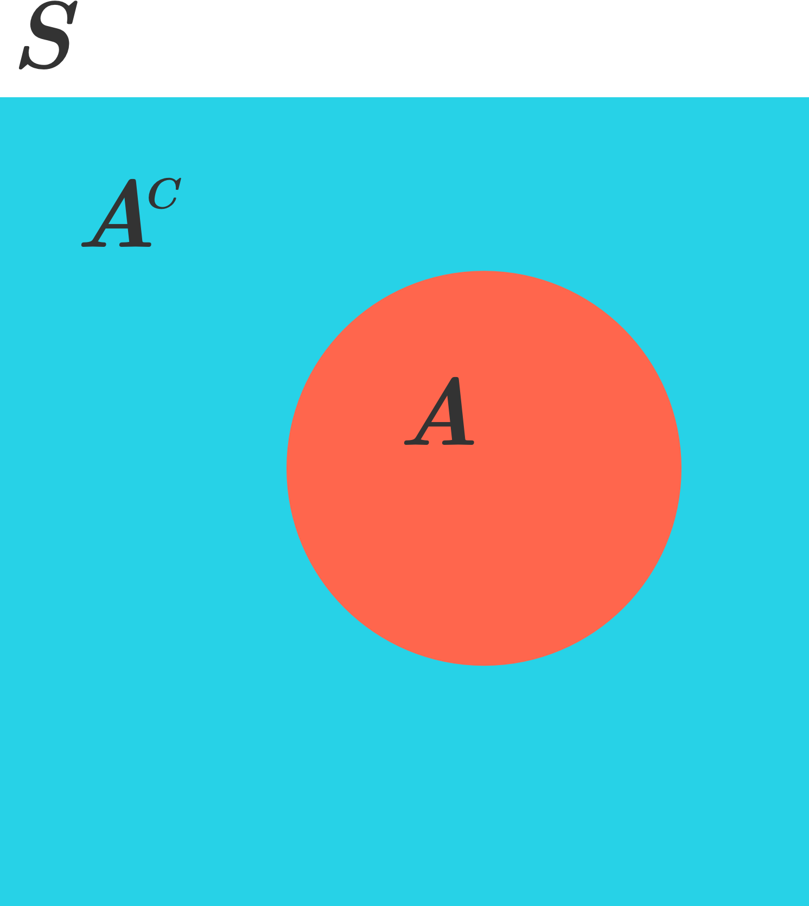

There are many scenarios where calculating the probability that an event **doesn't** happen is much easier than finding the probability it will. Fortunately, there's a connection between the two probabilities and they are related in a simple way.

Let $A$ be an event. Then the complement of that event, $A^c$, is the subset of all outcomes in the sample space that are not in $A$:

Since the sum of all probabilities must add to 1, the probability of $A^c$ is given by the **rule of complement** as:
$P(A^c) = 1 - P(A)$

For instance, if a six-sided die is rolled, then the sample space $S$ is said to be all of the possible die rolls 1 through 6. Now, if $A$ is defined as the event that the die roll is either 1 or 2, then $A^c$ would be the event that the roll is neither 1 nor 2, the probability of which is:

$P(A^c) = 1 - P(A) = 1 - 0.\overline{33} = 0.\overline{66}$.

In words, the probability that something doesn't happen is 1 minus the probability that it does happen. Sometimes the easiest way to find the probability an event will happen is to find the probability that the event won't happen and subtract that from 1. 

Recall that the **union** $(\cup)$ of multiple events means the probability that **any** event occurs. The union can be thought of as an “or” statement (either event $A_1,A_2,...$ or $A_n$ occurs). Also recall that the symbol $\prod$ means to multiply all terms together.

Let ${A_1,A_2,...A_{n-1},A_n$ be a set of $n$ _mutually indepndent events_. The probability of the _union_ (the union of events $A$ and $B$ is when $A$ happens, $B$ happens, or both $A$ and $B$ happen.) of these events is

$P\left(\displaystyle\bigcup_{i=1}^n A_i\right)=1-\displaystyle\prod_{i=1}^n P\left(A_i^c\right)$

This formula basically says that, to find the probability that **any** event in a set will occur, calculate the probability that **none** of the events in the set will occur, and subtract that from 1.