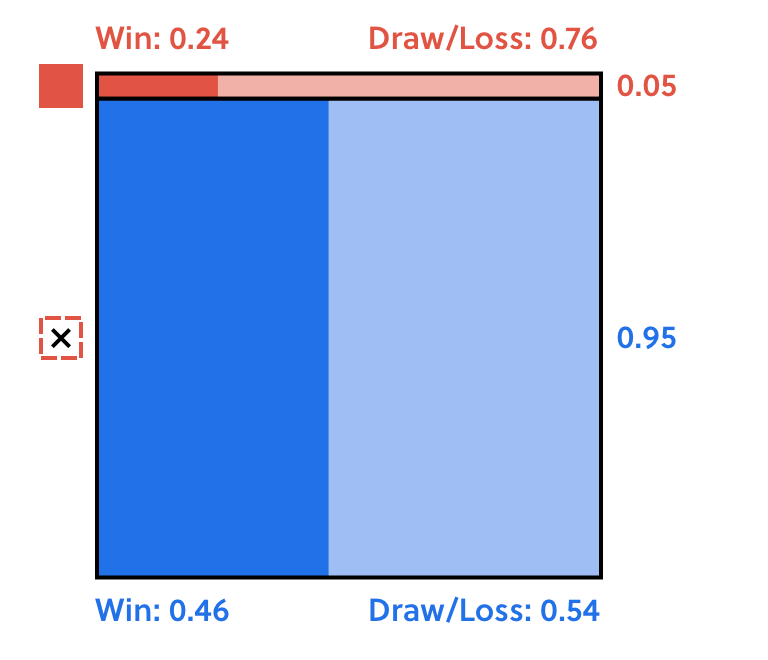

A **probability grid**: The full grid has an area of $1$ and represents all possible outcomes of a game/scenario. The area of each rectangle represents the probability of each outcome.

The **law of total probability** expresses the probability of an event as the sum of two distinct parts:

$P(A) = P(A\:and\:B) + P(A\:and\:not\:B)$

The **and** in these probabilities is found typically by multiplying the probability of $A$ and the probability of $B$.