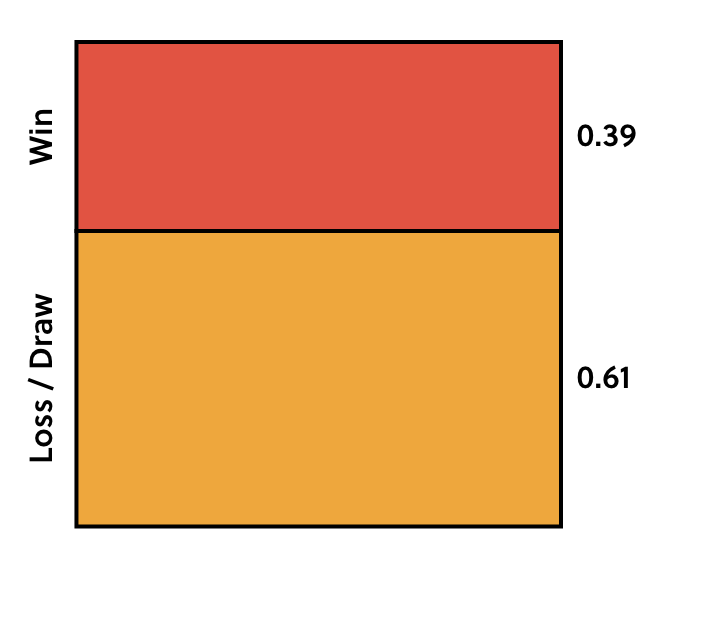
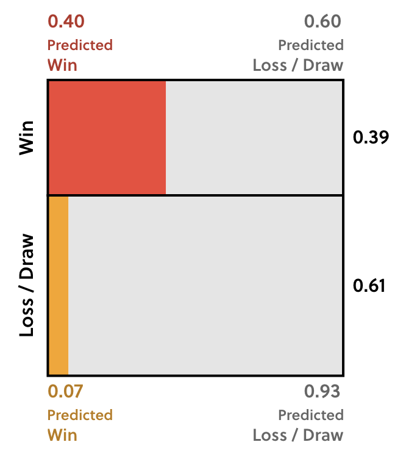

The grid below shows the probability of the London-based soccer team Fulham winning a game before any predictions have been made. The probability of Fulham winning can be expressed as $\frac{red}{red\:+\:orange}$

Here's how the picture changes when we only look at matches where the groundskeeper predicted a win.

Before the groundskeeper's prediction, the area of the red rectangle was $0.39$ After the groundskeeper's prediction, what is the area of the red rectangle now?

One side of the red rectangle is still equal to $P(Win) = 0.39$, but the other side decreased to $P(Predicted\:Win\:|\:Win) = 0.40$. So it's area is $0.40 * 0.39 = 0.16$

The red region has shrunk to $.40$ times its original size since the groundskeeper correctly predicts $40\%$ of wins. What about the other part of our ratio, that is, the sum of the red and orange regions?

Before the groundskeeper's prediction, the red and orange regions had a total area of $1$, as they represented all outcomes. Now, the combined red and orange regions represent $P(Predicted\:Win)$. We already knew that for the groundskeeper, $P(Predicted\:Win) = 0.2$. This means that:

* The red region is $P(Predicted\:Win\:|\:Win) = 0.40$ times its original size.
* The red and orange regions together are $P(Predicted\:Win) = 0.20$ times their original size.

Now, the ratio $\frac{red}{red + orange} = \frac{P(Predicted\:Win\:|\:Win)}{P(Predicted\:Win)}$ has **doubled**. We need to change our probability prediction by a factor of $\frac{P(Predicted\:Win\:|\:Win)}{P(Predicted\:Win)} = \frac{0.40}{0.20} = 2.00$. Before the groundskeeper's prediction, $P(Win) = 0.39$, now the $P(Win\:|\:Predicted\:Win)$ is $2 * 0.39 = .78$

This generalizes to **Bayes's Theorem**. **Bayes's theorem** tells us how to update the initial probability of event $A$ as we gather new information $B$:

$P(A|B) = \frac{P(B|A) * P(A)}{P(B)}$

### Applying Bayes's Theorem
Last season, Fulham's analyst correctly predicted $70\%$ of their wins and predicted a win in $40\%$ of all Fulham's games. **Before any predictions, we can take $P(Win) = 0.39$ for all games.**

If an analyist predicts a win, according to _Bayes's theorem_ and given the information in the previous sentence, this is how likely a Fulham victory is:

$P(Win\:|\:Predicted\:Win) = \frac{P(Predicted\:Win\:|\:Win) * P(Win)}{P(Predicted\:Win)} = \frac{0.70 * 0.39}{0.40} = 0.68$

The analyst's prediction increases our best estimate of Fulham's chances from `0.39` to `0.68` — a smaller effect than the groundskeeper's prediction. However, this does _not_ mean that the groundskeeper is better at predictions of Fulham soccer games than the analyst, because we haven't looked at predictions of draws and losses yet. If a good analyst predicts a loss or draw, we should lower our expectations of $P(Win)$ substantially.

Specfically we should multiply our estimate of $P(Win) = 0.39$ by $\frac{P(Predicted\:Loss\:or\:Draw\:|\:Win)}{P(Predicted\:Loss\:or\:Draw)}$ when the analyst predicts a loss or a draw. This is the $\frac{P(B|A)}{P(B)}$ part of _bayes's theorem_.

If the new evidence (the analyst's loss or draw prediction) is less likely when Fulham wins than when they don't, we should lower our estimate of the probability of a win.

**For the analyst**:
* $P(Predicted\:Win) = 0.40$
* $P(Predicted\:Win\:|\:Win) = 0.70$

The analyst predicts either a win or a lack of a win (a loss or a draw), so $P(Predicted\:Win)$ and $P(Predicted\:Loss\:or\:Draw)$ must add up to one. This means that $P(Predicted\:Loss\:or\:Draw) = 1 - 0.40 = 0.6$ and $P(Predicted\:Loss\:or\:Draw\:|\:Win) = 1 - 0.70 = 0.30$

**We've found that:**
* $P(Win) = 0.39$
* $P(Predicted\:Loss\:or\:Draw\:|\:Win) = 0.30$
* $P(Predicted\:Loss\:or\:Draw) = 0.60$

Thus according to _Bayes's theorem_ this is how likely Fulham would be to win if the _analyst_ predicted a loss or draw:

$P(Win\:|\:Predicted\:Loss\:or\:Draw) = \frac{P(Predicted\:Loss\:or\:Draw\:|\:Win) * P(Win)}{P(Predicted\:Loss\:or\:Draw\:)} = \frac{.3 * .39}{.6} = 0.20$

But for the groundskeeper we know from earlier that:

* $P(Predicted\:Loss\:or\:Draw) = 1 - 0.20 - 0.80$
* $P(Predicted\:Loss\:or\:Draw\:|\:Win) = 1 - 0.40 = 0.60$

Thus according to _Bayes's theorem_ this is how likely Fulham would be to win if the _groundskeeper_ predicted a loss or draw:

$P(Win\:|\:Predicted\:Loss\:or\:Draw) = \frac{P(Predicted\:Loss\:or\:Draw\:|\:Win) * P(Win)}{P(Predicted\:Loss\:or\:Draw\:)} = \frac{.6 * .39}{.8} = 0.9$

The groundskeeper's pessimistic approach makes his win predictions more reliable than the analyst's, but his loss or draw predictions are less reliable. Perhaps the analyst knows what she's doing after all.