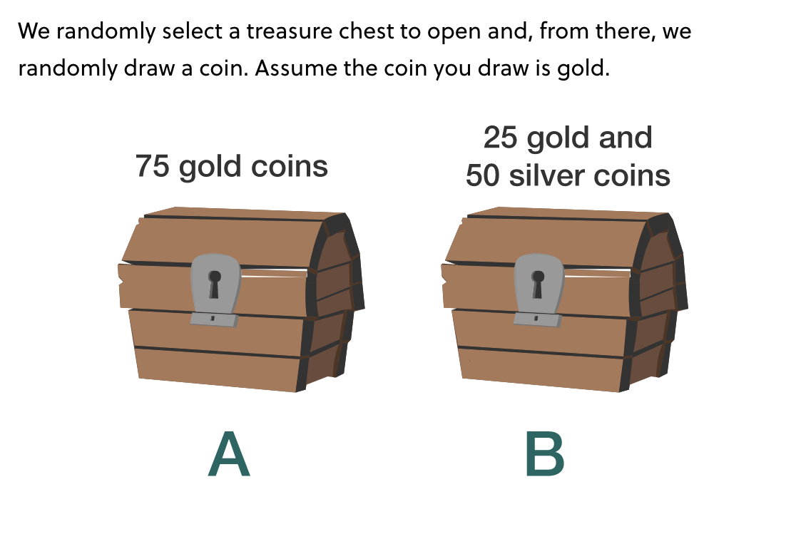
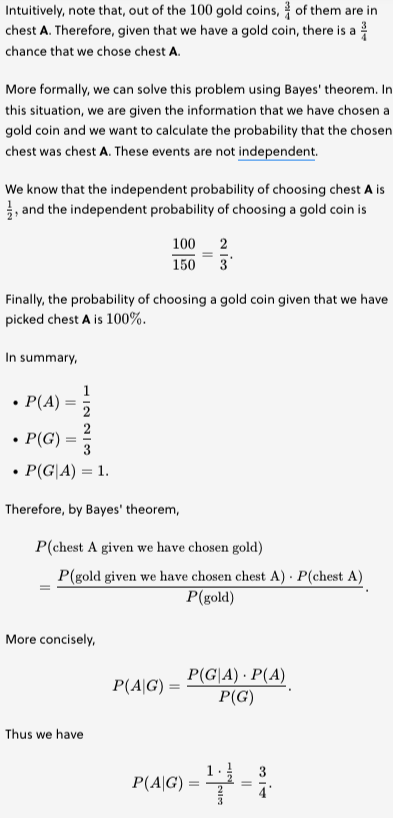
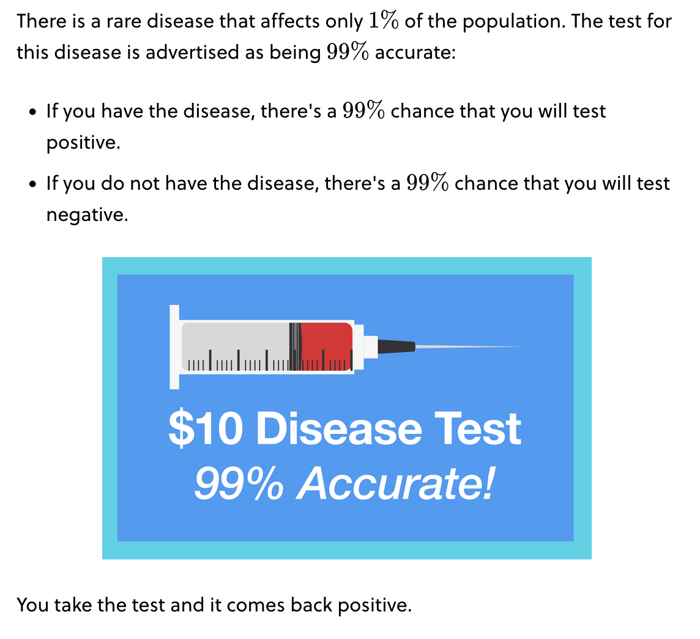
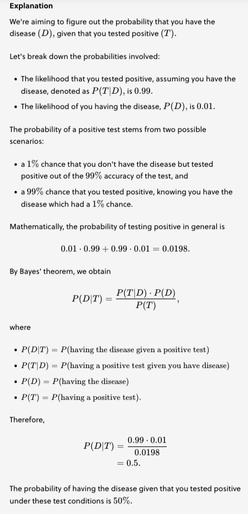
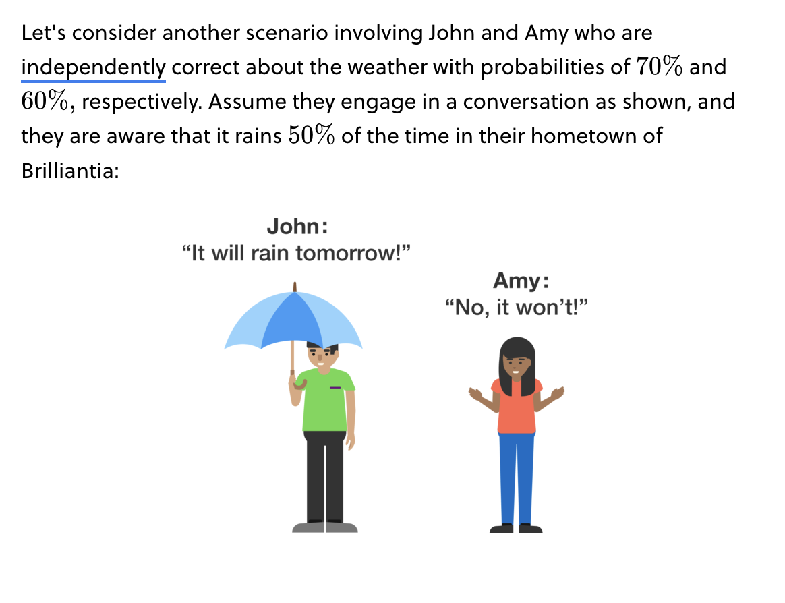
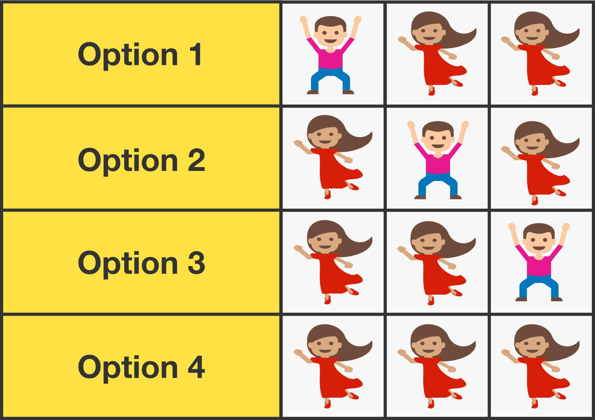

**Bayes' theorem** states that, given a hypothesis $H$ and an evidence $E$, the following holds:

The probability that $H$ is true _given that $E$ happened_ = (the natural probablity of $H$ happening) * (the probablity of $E$ happening given the assumption that $H$ is accurate) / the natural probablity of $E$ happening

That can be more succinctly written as:

$P(H|E) = \frac{P(H) * P(E|H)}{P(E)}$

Some examples:

Let's establish some variables for each event:

* $J$ — John's prediction that it will rain
* $A$ — Amy's prediction that it won't rain
* $W$ — the total weather forecast, that is, John's prediction and Amy's prediction as stated, $W=J∧A$
* $R$ — rainy weather.

Using Bayes' theorem,
$P(R|W) = \frac{P(R) * P(W|R)}{P(W)}$

It is relatively straightforward to calculate $P(W∣R)$:
* We know that $P(J∣R)=0.7$ since he is right 70% of the time.
* We also know that $P(A∣R)=0.4$ since she is wrong 40% of the time.

Since these predictions are independent, we obtain
$P(W∣R)=P(J∧A∣R)$
$=0.7⋅0.4$
$=0.28$

The probability of $W$ is slightly harder. The total $P(W)$ is given by the probability that prediction $W$ is made and is correct plus the probability that prediction $W$ is made and is incorrect.

Thus
$P(W)=P(W∣R)⋅P(R)+P(W∣R′)⋅P(R′)$

We already know $P(W∣R)=0.28$ and
$P(W∣R′)=0.3⋅0.6$
$=0.18$

because this would mean that John was wrong with a 30% chance and Amy was right with a 60% chance.

Thus,
$P(W)=0.28⋅P(R)+0.18⋅P(R′)$

Now, let $P(R)=x$. Substituting into Bayes' theorem as above, we have
$P(R∣W)=\frac{0.28x}{0.28x+0.18(1−x)}$.

Since we have assumed that the prior probability of rain is 50%, we have x=0.5 and (1−x)=0.5 and thus
$P(R∣W)=\frac{0.28⋅0.50}{.28⋅0.5+0.18⋅0.5}$
$=\frac{0.28}{0.28+0.18}$
$=\frac{14}{23}$
$≈60.9\%$

Note that if prior experience had taught us that there was only a 10% chance of rain — instead of the 50% given in the problem — John and Amy's predictions would have left us with this conclusion:
$P(R∣W)=\frac{0.28⋅0.1}{0.28⋅0.1+0.18⋅0.9}$
$=0.0280.19$
$≈14.7\%$

Bayes' theorem allows us to use new information to update our existing assumptions.

Suppose a family has 3 children where at least 2 of the 3 children are girls. What is the probability that all 3 children are girls?

We want to find the probability that all three of the children are girls, which we call $G$, given the knowledge that at least two of them are girls, which we call $T$.

Using Bayes' theorem,
$P(all~3~girls~given~at~least~2~girls)$
$=\frac{P(at~least~2~girls~given~all~3~girls)⋅P(all~3~girls)}{P(at~least~2~of~3~girls)}$

Restated,
$P(G∣T)=\frac{P(T∣G)⋅P(G)}{P(T)}$

We can find the missing terms as follows:
$P(T∣G)$ — The probability that two children would be girls given that all three are girls is 100%.
$P(G)$ — The probability that all three children will be girls is .5⋅.5⋅.5=.125
$P(T)$ — The probability that at least two out of three siblings would be girls is equal to the probability that all three are girls, which is .125, plus the probability that exactly two of the children are girls, which is 3⋅.125 = .375 So the sum of these two probabilities is

P(T)=.125​+.375​=.5.

Inserting this into the theorem, we have
$P(G∣T)=\frac{1⋅.125}{.5}$
$=14$.

We can also work this out intuitively by listing out the possibilities:

Since only one of the four possibilities results in all three of the children being girls, the probability is .25