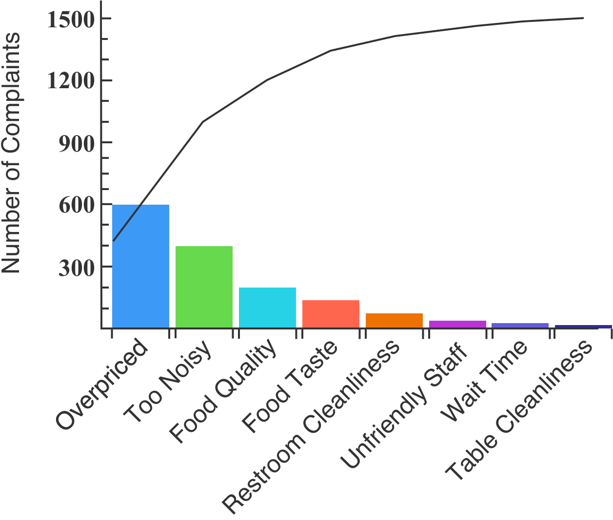

A **cumulative frequency graph** gives us valuable information about the shape of a data set. The **cumulative frequency** is the proportion _or_ total number of observations that are less than or equal to a certain value. We can use them to draw important conclusions, such as whether or not the rate of change is increasing, or whether or not a certain range of values contains many data points.

For any `x`-value, its corresponding `y`-value tells us how many observations are less than or equal to `x`.

The `80/20` rule, developed by Vilfredo Pareto, states that in many cases about 80% of all problems can be attributed to a few important causes. This can also be applied to consumption of goods. About 80% of healthcare costs are incurred by 20% of the population.

A **Pareto chart** combines a bar graph with a cumulative frequency line graph. Individual values are represented by bars that decrease in height from left to right. The cumulative frequency is represented by the line. Pareto charts are particularly useful when analyzing something's components.

