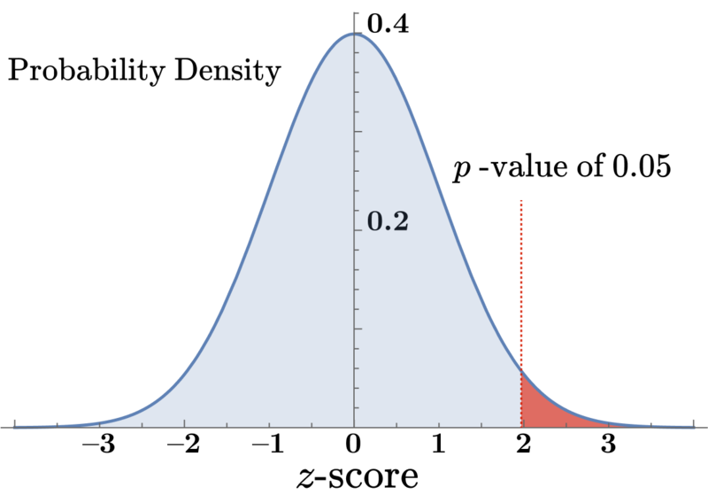
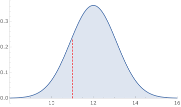

In **hypothesis testing**, we propose a theory about the world or some data we've collected, aiming to find out if our theory holds true. To verify these theories, it is necessary to collect data and pit it against a statistical model. During every test, it's essential to be open to the possibility that our theory might be erroneous.

The **null hypothesis** — typically denoted as $H_0$ — represents the absence of the relationship that the investigator is trying to prove. We utilize the null hypothesis to assess whether our data can be justified by randomness, rather than the relationship we are searching for.

To properly utilize a normal distribution model, the data set must have an adequate number of data points. As common sense dictates, accurately fitting a normal curve with merely 2 data points is an improbable algorithm.

A widely accepted thumb rule in such instances dictates that when our measures are dichotomous (successful or unsuccessful), our sample must be large enough to anticipate at least 10 instances of **each** result.

The $p$-value gives us the probability of encountering the current data if the null hypothesis is indeed true. For instance, a $p$-value of 0.05 suggests we would anticipate seeing data like this 5% of the time _if the null hypothesis is right_.

We would expect results in the red region — about 2 or more standard deviations from the mean — around 5% of the time. This aligns with a $p$-value of 0.05.

If the $p$-value is sufficiently low, then there's a reason to question the accuracy of the null hypothesis. In other words, a low $p$-value enhances our confidence that our hypothesis is correct and the null hypothesis isn't. Remember, the use of 0.05 as a threshold for rejecting the null hypothesis is somewhat arbitrary. Placing undue trust in the 0.05 value can be problematic.

### Example 1

A consulting firm has devised a new packaging system with the aim of cutting down on overweight packages. Before the implementation of the new system, the average rate of overweight packages was 12%. However, since its installation, a sample of 900 packages indicates that the rate of overweight packages has decreased to 11%.

What are the chances that this decline in overweight packages is just a result of random variations in the data, while the new system didn't actually make any real changes?

In order to solve this question, we must devise a model that aligns with our null hypothesis. Specifically, we need to construct our model presuming that the proportion of overweight packages remains at 12%, the distribution follows a normal curve, and $n$=900.

Given these assumptions, we calculated the **standard error** to be:

$\sigma = \sqrt{\frac{0.12 * 0.88}{900}} \approx 0.11 = 1.1\%$

Therefore, our model is represented as the following, where the numbers at the bottom signify the percentage of overweight boxes and the dotted red line indicates our collected sample:

Given the **standard error** of `0.011`, we can compute the $z$-score for our sample:

$z = \frac{0.11 - 0.12}{.011} \approx -0.91$

Even a casual look at these results suggests they are fairly probable under the null hypothesis. In short, this isn't very compelling evidence for the effectiveness of the new system — we wouldn't consider these results surprising, even if the system remained unchanged.

To ascertain the exact probability, we can refer to the probability distribution using a calculator or a table. Upon doing so, we find that a $z$-score of `−0.91` corresponds to a probability of `0.18`.

Hence, under the null hypothesis, we could expect 18% of experiments of this magnitude to yield a proportion of overweight packages equal to or less than our sample. Consequently, the $p$-value amounts to `0.18`.

Thus, things that will have a significant impact on our $p$-values: 
1. The sample size. A larger sample size $n$ will produce tighter distributions around the mean $\mu$ and smaller $p$-values
2. The overall distance of $x$, our sample proportion/mean away from $\mu$ our population proportion/mean.

### Example 2
The U.S. government stated that the average fuel economy of a 2015 Toyota Prius ranges from 46 to 50 miles per gallon.

The data from [Fuelly](http://www.fuelly.com/) reveals the actual fuel economy of 325 Toyota Priuses for the model year 2015:

Mean is:  `45.66462`
Median is:  `45.0`
Variance is:  `32.1429`
Standard deviation of the sample:  `5.66947`
Estimate of population's standard deviation:  `5.67821`

Does this data, with a $p$-value of `0.05`, lead us to believe that the government's reported range is too high?

The mean, $\bar{y}$​, of our sample data is approximately `45.665`, which is outside the range provided by the government report. Thus, further investigation is warranted.

Our null hypothesis in this context posits that the government's reported population range is not an overestimation. Therefore, our null hypothesis is that the population mean $\mu$ is greater than or equal to $46$.

We can model the standard deviation of the population using the standard deviation of our sample. Since we don't actually **know** the population mean, we are using $\bar{y}$ — calculating one statistic from an estimate of another — which requires us to use “degrees of freedom” to help correct the built-in bias of our sample. We are using the sample standard deviation divided by the square root of the sample size to calculate the sample standard error. We calculate $s \approx 5.678$.

Thus, the standard error is:

$SE(\bar{y}) = \frac{s}{sqrt{n}} \approx \frac{5.678}{\sqrt{325}} \approx 0.315$

Thus, based on this standard error, if the actual population mean were 46, we would expect to have our sample fall 

* below 46 (population mean) about 50% of the time,
* below 46 − 0.315 = 45.685 about 15.9% of the time, (one standard deviation away, on one tail of the distribution $\frac{100 - 68.3}{2} = 15.85$) and
* below 46 − 2 * 0.315 = 45.37 about 2.3% of the time, (two standard deviations away, on one tail of the distribution $\frac{100 - 95.5}{2} = 2.25$) etc.

We can calculate the $z$-score for our sampled value of 45.665: 

$z = \frac{45.665 - 46}{0.315} \approx -1.063$

Which is only slightly more than one standard deviation below the null hypothesis mean of 46. If the mean were in fact 46, we'd expect about 14.4% of collected samples to look like this. Thus, we do not have strong evidence to discard the reported value.