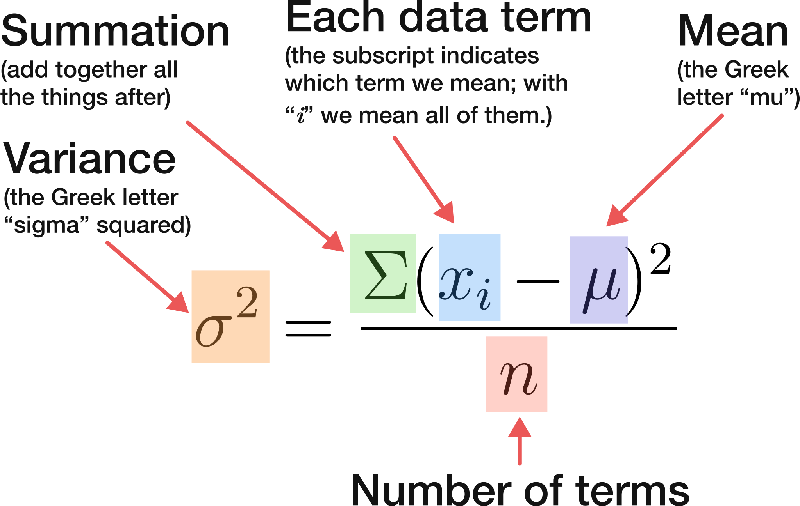

# The Two MADs

We often want to know how much data varies from the "center" – measured by the _measures of central tendancy_ like the mean, median, and mode. This is done with **measures of variation**.

One way to measure variation in a dataset is to use the __range__, which is the distance between the smallest and largest values in a data set. However, range can often be an inadequate description of the variance within a data set. Specifically, range ignores all the values in a set except for the largest and smallest, and therefore tells us nothing about the distribution of the values within the data set.

You can use the **mean absolute deviation**. This is done by finding the mean value of a data set, compare each value in the data set with the data set's mean to determine the deviation, and then find the mean of the absolute value of these deviations. The mean absolute deviation is a helpful statistic as it allows us to assign a single number to the average distance between each value and its mean in a data set.

Consider these two data sets:

$A = \{1, 13, 13, 13, 13, 25\}$ and $B = \{6, 6, 6, 14, 14, 14\}$

The mean absolute deviation for both sets is the same. It may appear that the values of `A` are more spread out than the values of `B` as it has significant outliers and a range of 24 which is far bigger than range of 8 we find in set `B`. However, according to the mean absolute deviation, they have the same amount of variance.

**Median absolute deviation** is a similar kind of statistic, but rather than calculating the mean values of the absolute differences from the mean, we calculate the **median value** of the absolute difference from the median.

The range tells us the total spread of a set of values, but does not give us any information about the distribution within that spread. Mean and median absolute deviations, on the other hand, summarize the differences between every value in the set and one of our central measures.

# Variance and Standard Deviation
If we take the mean of absolute differences between each data point and the mean, it leads to a problem. To solve this issue, a common remedy is to **square the differences**. Squaring the differences between data points and the mean tends to amplify the importance of outliers or extreme values. Consequently, a few data points situated far from the mean, even if unrepresentative of the overall data, will have a more significant impact. 

With this adjustment in the formula for mean absolute deviation, we derive the mean squared deviation, more popularly referred to as the **variance**:

$\frac{\text{the sum of (differences between data values and the mean, squared} )}{\text{number of values in the data set}}$

Variance: 

Although variance is an important measure, it can be challenging to comprehend in relation to the actual data. Whereas it's easy to visualize that the majority of data points are, for instance, about 22 units away from the mean, which is a scenario conveniently described by the mean absolute deviation, the concept of variance becomes more abstract due to the squaring process. Another point to note is that the units of variance differ from the original data units because of the squaring operation.

To reestablish a more intuitive understanding, we can take the square root of the variance. This measurement is known as the **standard deviation**, which is the square root of the variance:

$\text{standard deviation} = \sqrt{variance}$

In cases where data is evenly distributed around a central value without any bias, it may approximate a **normal distribution** or a bell curve. _Statistical bias_ is the propensity of a measurement process to systematically overvalue or undervalue a population parameter.

When analyzing data that follows a normal distribution pattern,

* Around 68% of data points are within one standard deviation from the mean,
* Roughly 95% of the data points fall within two standard deviations from the mean, and
* Almost all data — approximately 99.7% — is contained within three standard deviations from the mean:

You might have encountered variance calculations where the sum is divided by `n−1` instead of `n`. Up to this point, we've been using the formula suited for entire datasets, referred to as the **population**. However, in practical scenarios, we often deal with a **sample**, which is just a subset of the population. As we'll discuss in subsequent lessons, this situation calls for a slightly different variance formula.

