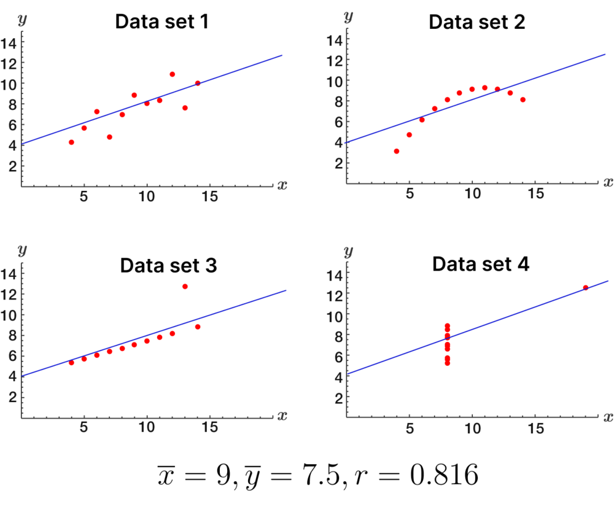

**Dependent variable**: A dependent variable is the variable that depends on how the independent variable changes. In equations, it is usually represented with the `y`-variable and is generally graphed on the `y`-axis.

**Independent variable**: An independent variable is the variable that is changed in a data set. In equations, it is usually represented with the `x`-variable and is generally graphed on the `x`-axis.

When the _dependent variable_ is numeric, we can attempt to model a linear relationship between the independent and dependent variables with a **regression line** – also known as the **line of best fit**.
A _regression line_ allows us to estimate the relationship among the variables and make predictions. While the line may not pass through all, or even any, of the data points, it can summarize the general pattern of the data. 

When dealing with bivariate – or two-variable – data, $\bar{x}$ is used to represent the mean of the `x` values – the input. The variable $\bar{y}$ is used to represent the mean of the `y` values – the output.

The **correlation coefficient** `r` measures the strength _and_ direction of a linear relationship. A perfectly linear relationship with a **positive** trend has `r=1` while no linear relationship has `r=0`.A perfectly linear relationship with a negative trend has `r=−1`.

We can also use the **coefficient of determination** $R^2$ to measure how close data are to fitted regression line. If $R^2 = 1$, then the data are perfectly fitted to the line. If $R^2 = 0$, the data is not fitted to the line. The *line of best fit* is one that optimizes $R^2$

One method to determine the best regression line is to minimize the **sum of squared residuals** or SSR. A **residual** is the difference between the actual _y_-value of the data point and the predicted _y_-value of the regression line.

Note that it is common to refer to the difference between the actual value and the predicted value as **sum of squares error** (SSE), but here we refer to this difference as the sum of squares residual — SSR. 

This should not be confused by the **sum of squares regression** — also called SSR — which refers to the difference between predicted values and the _average_.

Another important measure of scatterplot data is the **total sum of squares** – abbreviated either as SST or TSS.

The SST is very similar to the SSR, except it uses $\bar{y}$ (the average of y) instead of $\hat{y}_i$ for every point. The SST measures the variability in the `y`-variable as a whole.

We know that the sum of squared residuals (SSR) is the unaccounted-for variation in the dependent variable — or the variation that remains once the predictions of the regression equation are accounted for. What is “big” SSR or “small” SSR really depends on the context. Our goal is to find the linear model that creates the smallest possible SSR. This is where $R^2$ comes into play. 

The proportion of the variation in `y` that is unexplained is SSR/SST or the sum of squared residuals divided by the total sum of squares. Therefore, $R^2$, the statistic that shows the proportion of the variation in `y` that is accounted for by the linear regression equation is $R^2 = 1 - \frac{SSR}{SST}$

Squaring `r` – the correlation coefficient – gives us $R^2$ — **the coefficient of determination** — or the proportion of the variance in `y` that is predictable from `x`.

Unless $R^2=1$, there will always be some amount of variation in `y` that is unexplained by `x`.

# Why you need scatterplots
Four different data sets with unique visual characteristics can share the same statistics. Without the visual support of a graph, we might not know that seemingly normal data actually represents the set of points to create a square, a dinosaur, a star, or some other figure.

In fact, it's possible to create a bivariate data set with a given mean, median, and correlation in any shape.

Both statistics and graphs alone can be misleading, causing us to make misinformed decisions. When using both tools together, we are more likely to correctly interpret our data.

An example, Anscombe's quartet:

