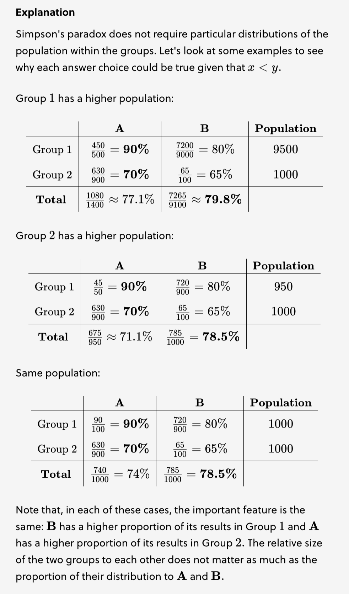

**Simpson's paradox** is a surprising result that arises when we find different directions of association between small groups and overall totals. When the the results favored `Phenomenon 1` for both `Group A` and `Group B`, but when viewed together in the aggregate, the results seemed to favor `Phenomenon 2`.

Population shifts within groups can account for every group's net median change declining while the overall cohort has increased over a time period, specifically when more people are moving into a higher value cohort. Simpson's paradox does not require particular distributions of the population within groups.

A **lurking variable** is a variable that is not included as an explanatory or response variable in the analysis but can affect the interpretation of relationships between variables. Such as gender in Titanic survival rates between the third class and the crew of the ship.

Simpson's paradox should give us some hesitation before jumping to conclusions about statistical data. Not only can important information be obscured by hidden variables or uneven distributions within our data — the results might even be the opposite of what they appear. Before accepting a statistical result at face value, ask yourself if there might be some additional information that would change the interpretation or even reverse it.