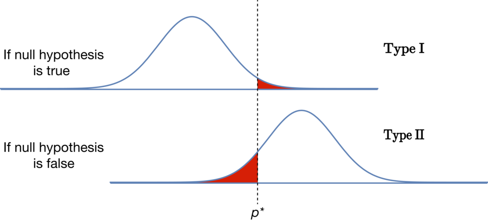
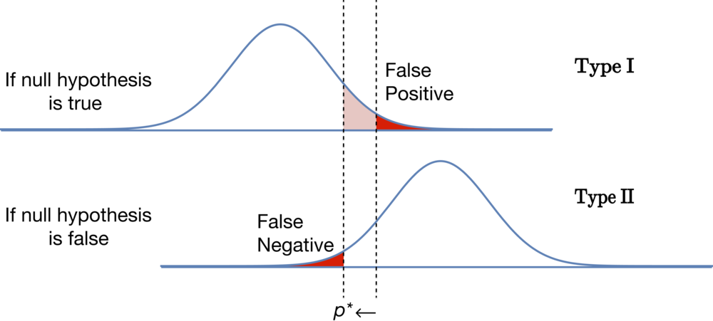
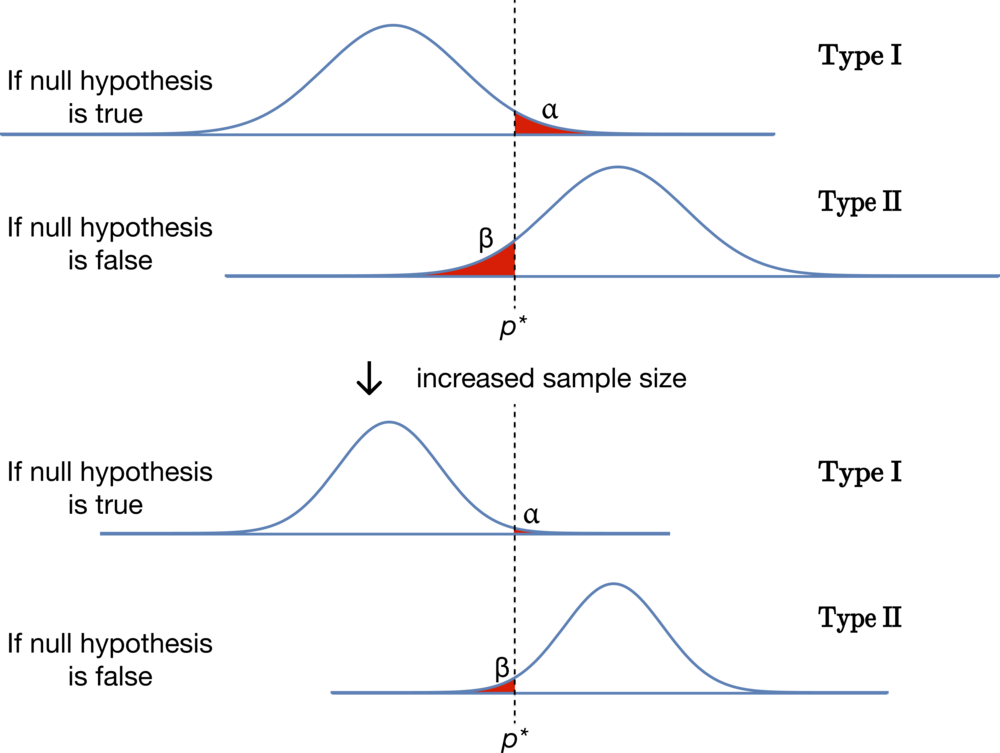

In hypothesis testing, we aim to validate a theory by comparing it to $H_0$​ — the null hypothesis.

We could potentially make two types of errors:

* Type I error — The null hypothesis is indeed true, but we mistakenly reject it, commonly referred to as a **false positive**. Type I errors are false positives — situations where we believe our theory to be true even though it is not. 
* Type II error — The null hypothesis is false, yet we erroneously fail to reject it, often known as a **false negative**. Type II errors are false negatives — situations where our theory is true but our data does not support rejecting $H_0$​.

In the diagram, notice the vertical line, which represents our $p$-value boundary, and $p^*$, which represents the particular proportion we must find to reject the null hypothesis:

Errors are marked in red. The upper graph shows Type I errors and the lower graph shows Type II errors:
* If our experiment produces a value **above** $p^*$, we will **reject** the null hypothesis.
* If we find a value **below** $p^*$, we will **not reject** the null hypothesis.

Succinctly:
* a **higher** $p$-value suggests a **larger** likelihood that a positive result derives from random variations in the null hypothesis model, and
* a **lower** $p$-value implies a **smaller** probability of a positive result originating from randomness in the null model.

_If_ we are trying to avoid false negatives, we must use a higher $p$-value. While this makes our test more sensitive and less likely to miss real results, it also make it more likely that we will believe we've found a real positive result when instead we've only found random variations.

Note the effect of changing the critical value in the image below. While shifting $p^*$ to the left — that is, increasing our $p$-value — reduces the probability of a false negative, it also increases the likelihood of a false positive. 

Note also that $p^*$ in the picture represents the critical proportion at which we will reject $H_0$. So, in this image, when $p^*$ goes to the left, the $p$-value is actually increasing:

* The probability of a Type I error, a.k.a "false positive" is called $\alpha$ pronounced “alpha.”
* The probability of a Type II error, a.k.a "false negative" is called $\beta$ pronounced “beta.”

The cost of a mistake depends upon the circumstances we are considering. In some cases, a false positive can be very damaging.

For instance, in the justice system, the null hypothesis assumes the defendant's innocence. A false positive, which would mean an innocent person goes to prison, can have severe consequences. As such, the United States has set the standard for criminal conviction to be “beyond a reasonable doubt.” In criminal trials, we strive for a low $\alpha$.

On the other hand, when dealing with food safety issues, the null hypothesis asserts that the food is safe. A false negative is much more consequential than a false positive in these scenarios. Compare the cost difference of needlessly throwing away a hamburger, a false positive, to serving a contaminated burger under the belief that it is safe, a false negative. When testing food for bacterial contamination, our objective is to keep $\beta$ low.

Therefore, statisticians need to carefully weigh the costs and benefits of potential errors before deciding on the critical values for their experiment. This kind of decision-making is of extreme importance due to its potential consequences.

$p$-hacking, involves running many experiments until one shows statistically significant results. This is one way to find a false positive even with a reasonable $\alpha$, so it also likely leads to false results being published.

It is easy to calculate the value of $\alpha$ — it is equal to the $p$-value of our experiment.

Calculating $\beta$ is more difficult. Although we can calculate the probability of a Type II error for any _specific_ value of the alternative hypothesis, we never know exactly what the true effect of the experiment will be — or else we wouldn't be doing an experiment.

In statistics, the **power** of an experiment is the likelihood that it will detect the effect it is seeking, assuming the effect is present.

Once we know $\beta$, we can calculate the power accurately, as it is the complement of $\beta$, represented as $1 - \beta$

For experiments with very small results, we might need to collect extensive data to be able to detect the results — otherwise, the power of our experiment might be too low.

The experiment's **sample size** determines the spread of the normal curve. Largest samples sizes mean tighter/higher cluster around the mean.

Is it ever possible to reduce both $\alpha$ and $\beta$ at the same time?

While we cannot reduce both $\alpha$ and $\beta$ by moving the value of $p^*$, it is possible to reduce them both.

Anything that reduces the **standard deviation** of our data reduces both $\alpha$ and $\beta$ at the same time. We can accomplish this in a few ways. For example, more accurate measurements will reduce the standard deviation. The most common approach, however, is to increase the sample size:

Note that — as seen in the lower pair of graphs — when we make changes to the experiment that reduces the standard deviation, it is possible to reduce the probability of both kinds of errors. This is why larger studies are often significantly more useful than small ones.