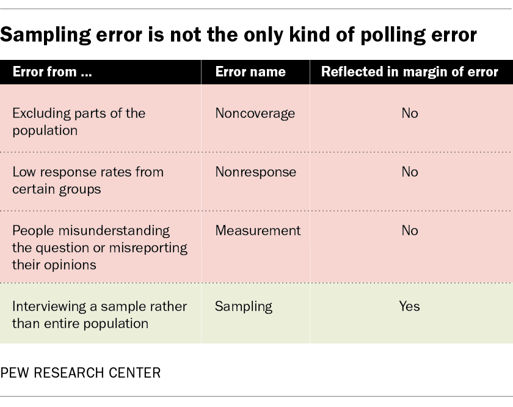

[Key things to know about U.S. election polling in 2024](https://www.pewresearch.org/short-reads/2024/08/28/key-things-to-know-about-us-election-polling-in-2024/)

### Terminology
* __Probability sampling or random sampling__: This refers to a polling method in which survey participants are recruited using _random sampling_ from a database or list that includes nearly everyone in the _population_. The pollster selects the sample. The survey is not open for anyone who wants to sign up.

* __Online opt-in polling or nonprobability sampling__: These polls are recruited using a variety of methods that are sometimes referred to as "convenience sampling". Respondents come from a variety of online sources such as ads on social media or search engines, websites offering rewards in exchange for survey participation, or self-enrollment. Unlike surveys with probability samples, people can volunteer to participate in opt-in surveys.

* __Nonresponse and nonresponse bias__: Nonresponse is when someone sampled for a survey does not participate. Nonresponse bias occurs when the pattern of nonresponse leads to error in a poll estimate. For example, college graduates are more likely than those without a degree to participate in surveys, leading to the potential that the share of college graduates in the resulting sample will be too high.

* __Mode of interview__: This refers to the format in which respondents are presented with and respond to survey questions. The most common modes are online, live telephone, text message and paper. Some polls use more than one mode.

* __Weighting__: This is a statistical procedure pollsters perform to make their survey align with the broader _population_ on key characteristics like age, race, etc. For example, if a survey has too many college graduates compared with their share in the population, people without a college degree are "weighted up" to match the proper share.

## Polling Methods

Previous Pew Research Center analyses have demonstrated how surveys that use nonprobability sampling may have [errors twice as large](https://www.pewresearch.org/methods/2023/09/07/comparing-two-types-of-online-survey-samples/), on average, as those that use probability sampling.

All good polling relies on statistical adjustment called “weighting,” which makes sure that the survey sample aligns with the broader population on key characteristics. Historically, public opinion researchers have adjusted their data using a core set of demographic variables to correct imbalances between the survey sample and the population.

But there is a growing realization among survey researchers that weighting a poll on just a few variables like age, race and gender is insufficient for getting accurate results. Some groups of people – such as older adults and college graduates – are more likely to take surveys, which can lead to errors that are too sizable for a simple three- or four-variable adjustment to work well.

## Error
The real margin of error is often about double the one reported. A typical election poll sample of about 1,000 people has a [margin of sampling error](https://www.pewresearch.org/short-reads/2016/09/08/understanding-the-margin-of-error-in-election-polls/) that’s about plus or minus 3 percentage points. That number expresses the uncertainty that results from taking a sample of the population rather than interviewing everyone. Random samples are likely to differ a little from the population just by chance, in the same way that the quality of your hand in a card game varies from one deal to the next.

The problem is that sampling error is not the only kind of error that affects a poll. Those other kinds of error, in fact, can be as large or larger than sampling error. Consequently, the reported margin of error can lead people to think that polls are more accurate than they really are.

There are three other, equally important sources of error in polling: [noncoverage error](https://en.wikipedia.org/wiki/Coverage_error), where not all the target population has a chance of being sampled; [nonresponse error](https://dism.duke.edu/files/2020/05/Tipsheet-Nonresponse_Error.pdf), where certain groups of people may be less likely to participate; and [measurement error](https://www.sciencedirect.com/science/article/pii/S0169716108000126#:~:text=Measurement%20errors%20are%20those%20errors,supervision%2C%20and%20insufficient%20quality%20control.), where people may not properly understand the questions or misreport their opinions. Not only does the margin of error fail to account for those other sources of potential error, putting a number only on sampling error implies to the public that other kinds of error do not exist. 

[Several](https://www.nytimes.com/2016/10/06/upshot/when-you-hear-the-margin-of-error-is-plus-or-minus-3-percent-think-7-instead.html) recent [studies](https://www.pewresearch.org/methods/2016/05/02/evaluating-online-nonprobability-surveys/) show that the [average total error](https://academic.oup.com/poq/article-abstract/75/4/709/1819617) in a poll estimate may be closer to twice as large as that implied by a typical margin of sampling error.

## [How to Read Political Polls](https://abcnews.go.com/538/read-political-polls-2024/story?id=113560546)
1. Check who conducted the poll
2. Check who sponsored the poll
3. Pay attention to who was polled
4. Don't forget about the margin of error
5. Check how the poll was written
6. Compare polls only if they were conducted by the same pollster
7. Don't pay attention to outliers. Instead, look at the average of the polls
8. Polls are generally accurate – but not perfect
9. Don't try to "unskew" the polls
10. Polls are snapshots, not predictions